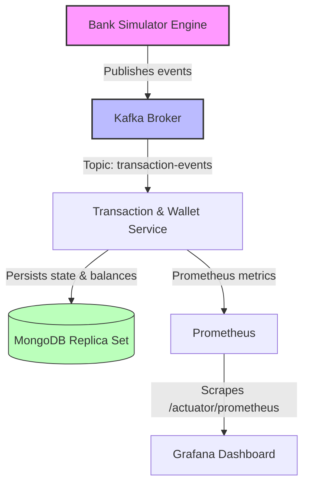

# Spring Boot Microservices Advanced Training

> **Duration:** 6 weeks  
> **Track Level:** Advanced  
> **Prerequisites:** Fundamentals track completed (Spring Boot basics, MongoDB CRUD, REST APIs, Spring Cloud concepts)

---

## Learning Objectives

By the end of this track, you will be able to:

- Design and implement event-driven architectures with Kafka
- Execute MongoDB multi-document ACID transactions
- Build a simulated banking system with real-time metrics
- Configure Prometheus + Grafana observability stacks
- Apply chaos testing and resiliency patterns

---

## Architecture Overview

The core engine is the **Bank Simulator Engine** — a Spring Scheduler acting as millions of simulated users making transfers.



**Tech Stack:**
- Spring Boot + Spring Scheduler
- Apache Kafka (Producers/Consumers)
- MongoDB 7.0 (Replica Set for ACID)
- Prometheus + Grafana (Observability)
- Docker Compose (Orchestration)

---

## Week 1: Dev Environment & Domain Design

### Docker Compose Setup

Full infrastructure stack — MongoDB replica set, Kafka, Zookeeper, and monitoring tools.

#### Code: `docker-compose.yml`

```yaml
version: '3.8'

services:
  # MongoDB Replica Set (Required for ACID Transactions)
  mongodb:
    image: mongo:7.0
    container_name: bank_mongo
    ports:
      - "27017:27017"
    command: ["--replSet", "rs0", "--bind_ip_all"]
    entrypoint: [
      "/bin/sh", "-c",
      "mongod --replSet rs0 --bind_ip_all & MONGOD_PID=$$!; sleep 4; mongosh --eval 'rs.initiate({_id:\"rs0\",members:[{_id:0,host:\"localhost:27017\"}]})'; wait $$MONGOD_PID"
    ]

  # Kafka Infrastructure
  zookeeper:
    image: confluentinc/cp-zookeeper:7.5.0
    container_name: bank_zookeeper
    environment:
      ZOOKEEPER_CLIENT_PORT: 2181

  kafka:
    image: confluentinc/cp-kafka:7.5.0
    container_name: bank_kafka
    ports:
      - "9092:9092"
    environment:
      KAFKA_BROKER_ID: 1
      KAFKA_ZOOKEEPER_CONNECT: zookeeper:2181
      KAFKA_ADVERTISED_LISTENERS: PLAINTEXT://localhost:9092
      KAFKA_OFFSETS_TOPIC_REPLICATION_FACTOR: 1
    depends_on:
      - zookeeper
```

### MongoDB Polymorphic Schemas

- Designing flexible document structures for different transaction types
- Using `_class` discriminator for type-safe polymorphism
- Schema evolution strategies

---

## Week 2: Sync API & MongoTemplate

### Wallet Deposits & Withdrawals

- Implementing synchronous REST endpoints for wallet operations
- Using `MongoTemplate` for complex update operations
- Debit/Credit patterns with atomic `inc()` operations

### ACID Multi-Document Transactions

- Single-node replica set enables multi-document ACID
- `@Transactional` annotation for cross-collection atomicity
- Rollback handling on failure

#### Code: Wallet Entity (`Wallet.java`)

```java
package com.wallet.simulator.entity;

import org.springframework.data.annotation.Id;
import org.springframework.data.mongodb.core.mapping.Document;
import java.math.BigDecimal;

@Document(collection = "wallets")
public class Wallet {
    @Id
    private String id;
    private String userId;
    private BigDecimal balance;

    // Getters, Setters, Constructors...
}
```

---

## Week 3: Async Messaging with Kafka

### Kafka Cluster Setup

- Broker, topic, and partition configuration
- Consumer groups and offset management
- JSON serialization/deserialization

### Producer/Consumer Patterns

- `KafkaTemplate` for event publishing
- `@KafkaListener` for async consumption
- Idempotent processing with transaction IDs

#### Code: Transaction Event DTO (`TransactionEvent.java`)

```java
package com.wallet.simulator.dto;

import java.math.BigDecimal;
import java.time.Instant;

public record TransactionEvent(
    String transactionId,
    String senderWalletId,
    String receiverWalletId,
    BigDecimal amount,
    String currency,
    Instant timestamp
) {}
```

#### Code: Banking Simulator Service (`BankingSimulatorService.java`)

```java
package com.wallet.simulator.service;

import com.wallet.simulator.dto.TransactionEvent;
import org.slf4j.Logger;
import org.slf4j.LoggerFactory;
import org.springframework.kafka.core.KafkaTemplate;
import org.springframework.scheduling.annotation.Scheduled;
import org.springframework.stereotype.Service;

import java.math.BigDecimal;
import java.time.Instant;
import java.util.List;
import java.util.Random;
import java.util.UUID;

@Service
public class BankingSimulatorService {

    private static final Logger log = LoggerFactory.getLogger(BankingSimulatorService.class);
    private final KafkaTemplate<String, TransactionEvent> kafkaTemplate;
    private final Random random = new Random();

    private final List<String> mockWalletIds = List.of(
        "wallet-user-001", "wallet-user-002", "wallet-user-003", "wallet-user-004"
    );

    public BankingSimulatorService(KafkaTemplate<String, TransactionEvent> kafkaTemplate) {
        this.kafkaTemplate = kafkaTemplate;
    }

    @Scheduled(fixedRate = 2000)
    public void generateSimulatedTransaction() {
        String sender = mockWalletIds.get(random.nextInt(mockWalletIds.size()));
        String receiver;
        do {
            receiver = mockWalletIds.get(random.nextInt(mockWalletIds.size()));
        } while (sender.equals(receiver));

        BigDecimal randomAmount = BigDecimal.valueOf(10 + (1000 - 10) * random.nextDouble())
                                             .setScale(2, BigDecimal.ROUND_HALF_UP);

        TransactionEvent event = new TransactionEvent(
            UUID.randomUUID().toString(),
            sender,
            receiver,
            randomAmount,
            "USD",
            Instant.now()
        );

        log.info("Simulator generated event: {} sends ${} to {}", sender, randomAmount, receiver);

        kafkaTemplate.send("transaction-events", event.transactionId(), event);
    }
}
```

#### Code: Transaction Consumer (`TransactionConsumer.java`)

```java
package com.wallet.simulator.consumer;

import com.wallet.simulator.dto.TransactionEvent;
import com.wallet.simulator.entity.Wallet;
import org.slf4j.Logger;
import org.slf4j.LoggerFactory;
import org.springframework.data.mongodb.core.MongoTemplate;
import org.springframework.data.mongodb.core.query.Criteria;
import org.springframework.data.mongodb.core.query.Query;
import org.springframework.data.mongodb.core.query.Update;
import org.springframework.kafka.annotation.KafkaListener;
import org.springframework.stereotype.Service;
import org.springframework.transaction.annotation.Transactional;

@Service
public class TransactionConsumer {

    private static final Logger log = LoggerFactory.getLogger(TransactionConsumer.class);
    private final MongoTemplate mongoTemplate;

    public TransactionConsumer(MongoTemplate mongoTemplate) {
        this.mongoTemplate = mongoTemplate;
    }

    @KafkaListener(topics = "transaction-events", groupId = "wallet-processing-group")
    @Transactional
    public void processTransaction(TransactionEvent event) {
        log.info("Consuming transaction: {}", event.transactionId());

        Query senderQuery = new Query(Criteria.where("id").is(event.senderWalletId()));
        Update debit = new Update().inc("balance", event.amount().negate());
        mongoTemplate.updateFirst(senderQuery, debit, Wallet.class);

        Query receiverQuery = new Query(Criteria.where("id").is(event.receiverWalletId()));
        Update credit = new Update().inc("balance", event.amount());
        mongoTemplate.updateFirst(receiverQuery, credit, Wallet.class);

        log.info("Successfully completed transaction audit logic for UUID {}", event.transactionId());
    }
}
```

---

## Week 4: Event-Driven Engine

### Simulated Banking Loop

- Running long-lived synthetic transaction streams
- Tuning `@Scheduled` rate for load simulation
- Monitoring consumer lag as volume increases

### Outbox Pattern

- Ensuring reliable event publishing with transactional outbox
- Polling publisher vs. CDC-based approaches
- Preventing duplicate events with idempotency keys

### Eventual Consistency

- Accepting eventual consistency across distributed services
- Saga pattern for multi-step operations
- Compensating transactions for rollback scenarios

---

## Week 5: Aggregations & Analytics

### MongoDB Aggregation Pipelines

- Building pipeline stages: `$match`, `$group`, `$lookup`, `$sort`
- Real-time transaction volume aggregation
- Wallet balance summaries and reporting

### Dashboard Queries

- Top senders/receivers by volume
- Transaction frequency distributions
- Currency-based aggregations

---

## Week 6: Resiliency & Observability

### Chaos Testing

- Simulating network drops between Kafka and consumers
- Schema changes under load
- Consumer failure and automatic rebalancing
- MongoDB replica set failover testing

### Metrics to Track

#### A. Kafka Metrics

| Metric | Description |
|--------|-------------|
| Consumer Lag | Messages published but not yet consumed |
| Consumer Poll Latency | Time to pull a batch from the broker |
| Record Send Rate | Simulated events piped into Kafka per second |

#### B. MongoDB Metrics

| Metric | Description |
|--------|-------------|
| Command Execution Latency | Time for updates, inserts, and commits |
| Connection Pool | Active connections vs. available pool size |

#### C. JVM Metrics

| Metric | Description |
|--------|-------------|
| Virtual Threads | Java 21 virtual thread counts |
| GC Pauses | Garbage collection pauses affecting poll loops |

#### D. Custom Business Metrics

| Metric | Description |
|--------|-------------|
| Transaction Volume Counter | Cumulative USD processed |
| Failed Transaction Rate | Rollback count (e.g., insufficient funds) |
| Active Simulated Users | Gauge of synthetic accounts sending money |

---

### Prometheus + Grafana Monitoring

#### Updated Stack: `docker-compose.yml`

```yaml
version: '3.8'

networks:
  bank-network:
    driver: bridge

services:
  mongodb:
    image: mongo:7.0
    container_name: bank_mongo
    ports:
      - "27017:27017"
    networks:
      - bank-network
    command: ["--replSet", "rs0", "--bind_ip_all"]
    entrypoint: [
      "/bin/sh", "-c",
      "mongod --replSet rs0 --bind_ip_all & MONGOD_PID=$$!; sleep 4; mongosh --eval 'rs.initiate({_id:\"rs0\",members:[{_id:0,host:\"localhost:27017\"}]})'; wait $$MONGOD_PID"
    ]

  zookeeper:
    image: confluentinc/cp-zookeeper:7.5.0
    container_name: bank_zookeeper
    networks:
      - bank-network
    environment:
      ZOOKEEPER_CLIENT_PORT: 2181

  kafka:
    image: confluentinc/cp-kafka:7.5.0
    container_name: bank_kafka
    ports:
      - "9092:9092"
    networks:
      - bank-network
    environment:
      KAFKA_BROKER_ID: 1
      KAFKA_ZOOKEEPER_CONNECT: zookeeper:2181
      KAFKA_ADVERTISED_LISTENERS: PLAINTEXT://kafka:9092,PLAINTEXT_HOST://localhost:9092
      KAFKA_LISTENER_SECURITY_PROTOCOL_MAP: PLAINTEXT:PLAINTEXT,PLAINTEXT_HOST:PLAINTEXT
      KAFKA_OFFSETS_TOPIC_REPLICATION_FACTOR: 1
    depends_on:
      - zookeeper

  prometheus:
    image: prom/prometheus:latest
    container_name: bank_prometheus
    ports:
      - "9090:9090"
    networks:
      - bank-network
    volumes:
      - ./prometheus.yml:/etc/prometheus/prometheus.yml

  grafana:
    image: grafana/grafana:latest
    container_name: bank_grafana
    ports:
      - "3000:3000"
    networks:
      - bank-network
    environment:
      - GF_SECURITY_ADMIN_PASSWORD=admin
    depends_on:
      - prometheus
```

#### Prometheus Scraper: `prometheus.yml`

```yaml
global:
  scrape_interval: 5s

scrape_configs:
  - job_name: 'spring-boot-wallet'
    metrics_path: '/actuator/prometheus'
    static_configs:
      - targets: ['wallet-service:8080']
```

#### Spring Boot Dependencies (`pom.xml`)

```xml
<dependency>
    <groupId>org.springframework.boot</groupId>
    <artifactId>spring-boot-starter-actuator</artifactId>
</dependency>
<dependency>
    <groupId>io.micrometer</groupId>
    <artifactId>micrometer-registry-prometheus</artifactId>
    <scope>runtime</scope>
</dependency>
```

#### Application Configuration (`application.yml`)

```yaml
management:
  endpoints:
    web:
      exposure:
        include: "health,info,prometheus"
  endpoint:
    prometheus:
      enabled: true
  metrics:
    export:
      prometheus:
        enabled: true
    tags:
      application: wallet-simulator-app
```

#### Custom Micrometer Metrics (`TransactionConsumer.java`)

```java
package com.wallet.simulator.consumer;

import com.wallet.simulator.dto.TransactionEvent;
import io.micrometer.core.instrument.Counter;
import io.micrometer.core.instrument.MeterRegistry;
import org.springframework.kafka.annotation.KafkaListener;
import org.springframework.stereotype.Service;
import org.springframework.transaction.annotation.Transactional;

@Service
public class TransactionConsumer {

    private final MongoTemplate mongoTemplate;

    private final Counter transactionVolumeCounter;
    private final Counter transactionFailureCounter;

    public TransactionConsumer(MongoTemplate mongoTemplate, MeterRegistry registry) {
        this.mongoTemplate = mongoTemplate;

        this.transactionVolumeCounter = Counter.builder("banking.transactions.volume")
                .description("Total USD volume successfully transacted")
                .register(registry);

        this.transactionFailureCounter = Counter.builder("banking.transactions.failed")
                .description("Total failed financial transactions")
                .register(registry);
    }

    @KafkaListener(topics = "transaction-events", groupId = "wallet-processing-group")
    @Transactional
    public void processTransaction(TransactionEvent event) {
        try {
            executeDatabaseTransfer(event);
            this.transactionVolumeCounter.increment(event.amount().doubleValue());
        } catch (Exception e) {
            this.transactionFailureCounter.increment();
            throw e;
        }
    }
}
```

### Grafana Setup

1. Open Grafana at `http://localhost:3000` (admin/admin)
2. Add Prometheus data source → URL: `http://prometheus:9090`
3. Import **JVM Dashboard ID: 4701**
4. Query `kafka_consumer_*` metrics for consumer lag panels

---

## Repository Structure

```
banking-wallet-sandbox/
├── .github/
│   └── workflows/
├── docker/
│   ├── grafana/
│   │   └── provisioning/
│   │       ├── dashboards/
│   │       └── datasources/
│   │           └── prometheus.yml
│   └── prometheus/
│       └── prometheus.yml
├── docker-compose.yml
│
├── shared-dto/
│   ├── pom.xml
│   └── src/main/java/com/wallet/shared/dto/TransactionEvent.java
│
├── bank-simulator/
│   ├── Dockerfile
│   ├── pom.xml
│   └── src/
│       └── main/
│           ├── java/com/wallet/simulator/
│           │   ├── BankSimulatorApplication.java
│           │   ├── config/
│           │   └── service/
│           └── resources/
│               └── application.yml
│
└── wallet-service/
    ├── Dockerfile
    ├── pom.xml
    └── src/
        ├── main/
        │   ├── java/com/wallet/service/
        │   │   ├── WalletApplication.java
        │   │   ├── config/
        │   │   ├── consumer/
        │   │   ├── controller/
        │   │   ├── entity/
        │   │   └── repository/
        │   └── resources/
        │       └── application.yml
        └── test/
            └── java/com/wallet/service/
                └── integration/
```

---

## 6-Week Roadmap

```mermaid
gantt
    title 6-Week Advanced Training Roadmap (Weekdays Only)
    dateFormat  YYYY-MM-DD
    axisFormat %a

    section Week 1: Dev Environment
    Docker Compose & Domain Design    :active, dev, 2026-07-06, 3d
    MongoDB Polymorphic Schemas       :schema, 2026-07-09, 2d

    section Week 2: Sync Transactions
    Wallet Deposits & Withdrawals     :sync1, 2026-07-13, 3d
    ACID Multi-Document Txns          :crit, sync2, 2026-07-16, 2d

    section Week 3: Kafka Messaging
    Kafka Cluster Setup               :kafka1, 2026-07-20, 2d
    Producer/Consumer Patterns        :kafka2, 2026-07-22, 3d

    section Week 4: Event-Driven
    Simulated Banking Loop            :event1, 2026-07-27, 2d
    Outbox Pattern & Consistency      :event2, 2026-07-29, 3d

    section Week 5: Analytics
    Aggregation Pipelines             :agg1, 2026-08-03, 3d
    Dashboard Queries                 :agg2, 2026-08-06, 2d

    section Week 6: Resiliency
    Chaos Testing                     :chaos, 2026-08-10, 2d
    Prometheus & Grafana              :crit, obs, 2026-08-12, 3d

    style Week1 fill:#f5f5f5,stroke:#616161,color:#212121
    style Week2 fill:#f5f5f5,stroke:#616161,color:#212121
    style Week3 fill:#f5f5f5,stroke:#616161,color:#212121
    style Week4 fill:#f5f5f5,stroke:#616161,color:#212121
    style Week5 fill:#f5f5f5,stroke:#616161,color:#212121
    style Week6 fill:#f5f5f5,stroke:#616161,color:#212121
    style dev fill:#e3f2fd,stroke:#1565c0,color:#0d47a1
    style schema fill:#e3f2fd,stroke:#1565c0,color:#0d47a1
    style sync1 fill:#e8f5e9,stroke:#2e7d32,color:#1b5e20
    style sync2 fill:#e8f5e9,stroke:#2e7d32,color:#1b5e20
    style kafka1 fill:#fff3e0,stroke:#e65100,color:#bf360c
    style kafka2 fill:#fff3e0,stroke:#e65100,color:#bf360c
    style event1 fill:#fce4ec,stroke:#c62828,color:#b71c1c
    style event2 fill:#fce4ec,stroke:#c62828,color:#b71c1c
    style agg1 fill:#f3e5f5,stroke:#6a1b9a,color:#4a148c
    style agg2 fill:#f3e5f5,stroke:#6a1b9a,color:#4a148c
    style chaos fill:#e0f2f1,stroke:#00695c,color:#004d40
    style obs fill:#e0f2f1,stroke:#00695c,color:#004d40
```
