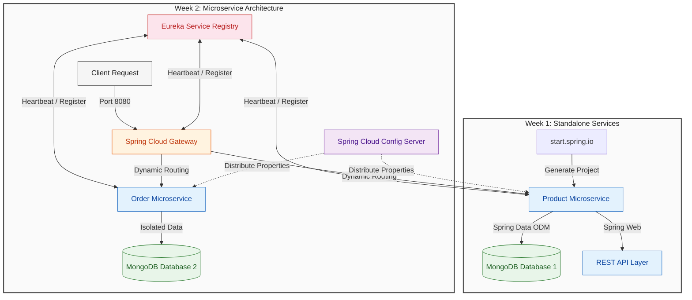

# Spring Boot & MongoDB Fundamentals

> **Duration:** 2 weeks  
> **Track Level:** Beginner  
> **Prerequisites:** Basic Java knowledge, MongoDB installed or Docker available

---

## Learning Objectives

By the end of this track, you will be able to:

- Bootstrap a Spring Boot project with Spring Initializr
- Integrate MongoDB using Spring Data ODM
- Build RESTful APIs with `@RestController`
- Understand microservice infrastructure with Spring Cloud
- Package and run containerized services with Docker

---

## Milestone Checklist

| Milestone | Goal |
|-----------|------|
| **End of Week 1** | Run a standalone Spring Boot app that reads/writes custom Java objects to MongoDB via a REST API |
| **End of Week 2** | Spin up a cluster of services behind an API Gateway, pulling config from a centralized server |

---

## Week 1: Core Components

### Day 1-2: Spring Initializr & Environment Setup

**Topics:**
- [Spring Initializr](https://start.spring.io/) — bootstrap project structure, select build tool (Maven/Gradle), choose Java runtime
- **Auto-Configuration** — classpath scanning to auto-configure components (e.g., connection pools when MongoDB starters are detected)
- **Unified Starters** — bundled dependencies like `spring-boot-starter-web` and `spring-boot-starter-data-mongodb`

**Reference:** [Spring Projects Page](https://spring.io/projects)

---

### Day 3-5: MongoDB Integration & Object-Document Mapping (ODM)

**Topics:**
- **Repository Pattern** — interfaces extending `MongoRepository<T, ID>` with auto-generated CRUD implementations
- **Derived Query Methods** — declarative signatures like `List<User> findByEmail(String email)` parsed into MongoDB queries
- **`MongoTemplate`** — fluent API for complex queries, aggregations, and bulk operations
- **Mapping Annotations:**
  - `@Document(collection = "name")` — maps entity to a MongoDB collection
  - `@Id` — identifies the BSON `_id` primary key
  - `@Indexed` — creates a MongoDB index on the property

**Reference:** [Spring Data MongoDB Project](https://spring.io/projects/spring-data-mongodb)

#### Code: Document Entity (`Product.java`)

```java
package com.example.catalogservice.model;

import org.springframework.data.annotation.Id;
import org.springframework.data.mongodb.core.mapping.Document;
import org.springframework.data.mongodb.core.mapping.Indexed;

@Document(collection = "products")
public class Product {

    @Id
    private String id;

    @Indexed
    private String sku;
    private String name;
    private Double price;

    public Product() {}

    public Product(String sku, String name, Double price) {
        this.sku = sku;
        this.name = name;
        this.price = price;
    }

    public String getId() { return id; }
    public void setId(String id) { this.id = id; }
    public String getSku() { return sku; }
    public void setSku(String sku) { this.sku = sku; }
    public String getName() { return name; }
    public void setName(String name) { this.name = name; }
    public Double getPrice() { return price; }
    public void setPrice(Double price) { this.price = price; }
}
```

#### Code: Data Repository (`ProductRepository.java`)

```java
package com.example.catalogservice.repository;

import com.example.catalogservice.model.Product;
import org.springframework.data.mongodb.repository.MongoRepository;
import org.springframework.stereotype.Repository;

import java.util.Optional;

@Repository
public interface ProductRepository extends MongoRepository<Product, String> {
    Optional<Product> findBySku(String sku);
}
```

---

### Day 6-7: REST Controllers & API Design

**Topics:**
- `@RestController` — structuring HTTP endpoint classes
- HTTP verb mapping (`GET`, `POST`, `PUT`, `DELETE`)
- JSON payload serialization with `@RequestBody` and `@ResponseBody`

**Reference:** [Building a RESTful Web Service](https://spring.io/guides/gs/restservice/)

#### Code: REST Controller (`ProductController.java`)

```java
package com.example.catalogservice.controller;

import com.example.catalogservice.model.Product;
import com.example.catalogservice.repository.ProductRepository;
import org.springframework.http.HttpStatus;
import org.springframework.http.ResponseEntity;
import org.springframework.web.bind.annotation.*;

import java.util.List;

@RestController
@RequestMapping("/api/products")
public class ProductController {

    private final ProductRepository productRepository;

    public ProductController(ProductRepository productRepository) {
        this.productRepository = productRepository;
    }

    @GetMapping
    public List<Product> getAllProducts() {
        return productRepository.findAll();
    }

    @PostMapping
    public ResponseEntity<Product> createProduct(@RequestBody Product product) {
        Product savedProduct = productRepository.save(product);
        return new ResponseEntity<>(savedProduct, HttpStatus.CREATED);
    }

    @GetMapping("/sku/{sku}")
    public ResponseEntity<Product> getProductBySku(@PathVariable String sku) {
        return productRepository.findBySku(sku)
                .map(product -> new ResponseEntity<>(product, HttpStatus.OK))
                .orElse(new ResponseEntity<>(HttpStatus.NOT_FOUND));
    }
}
```

#### Code: Application Configuration (`application.yml`)

```yaml
spring:
  application:
    name: catalog-service
  data:
    mongodb:
      uri: mongodb://localhost:27017/catalog_db

server:
  port: 8081
```

---

## Week 2: Microservices Fabric

### Day 1-2: Service Registry (Eureka Server)

**Topics:**
- **Service Discovery** — dynamic registry where microservices broadcast their network coordinates (IP + port)
- Netflix Eureka as the discovery server
- Service registration and heartbeat mechanisms

**Reference:** [Service Registration and Discovery Guide](https://spring.io/guides/gs/service-registration-and-discovery/)

---

### Day 3-4: API Gateway Routing (Spring Cloud Gateway)

**Topics:**
- **API Gateway** — unified reverse proxy for routing, token verification, and rate-limiting
- Dynamic routing to downstream microservices
- Edge security patterns

**Reference:** [Spring Cloud Gateway Reference](https://spring.io/projects/spring-cloud-gateway)

---

### Day 5: Centralized Configuration (Config Server)

**Topics:**
- **Spring Cloud Config** — externalized properties in a central server (typically Git-backed)
- Dynamic property distribution across services
- Environment-specific configuration management

**Reference:** [Centralized Configuration Guide](https://spring.io/guides/gs/centralized-configuration/)

---

### Day 6-7: Docker Packaging & Local Run

**Topics:**
- Containerizing Spring Boot applications
- Docker Compose for multi-service orchestration
- Network isolation between services

#### Code: Basic `pom.xml` Dependencies

```xml
<dependencies>
    <dependency>
        <groupId>org.springframework.boot</groupId>
        <artifactId>spring-boot-starter-web</artifactId>
    </dependency>

    <dependency>
        <groupId>org.springframework.boot</groupId>
        <artifactId>spring-boot-starter-data-mongodb</artifactId>
    </dependency>
</dependencies>
```

---

## Architecture Overview



---

## Inter-Service Communication

Decoupled services communicate via:
- **OpenFeign** — declarative REST clients
- **WebClient** — non-blocking reactive pipelines

---

## 2-Week Roadmap

```mermaid
gantt
    title 2-Week Spring Boot & MongoDB Fundamentals Roadmap (Weekdays Only)
    dateFormat  YYYY-MM-DD
    axisFormat %a

    section Week 1: Core Components
    Spring Initializr & Env Setup       :active, env, 2026-05-25, 2d
    MongoDB Integration & Mapping ODM   :crit, data, 2026-05-27, 3d
    REST Controllers & API Design       :api, 2026-06-01, 2d

    section Week 2: Microservices Fabric
    Service Registry (Eureka Server)    :cloud1, 2026-06-03, 2d
    API Gateway Routing                 :cloud2, 2026-06-05, 2d
    Central Config Server               :cloud3, 2026-06-08, 1d
    Docker Packaging & Local Run        :crit, deploy, 2026-06-09, 2d

    style Week1 fill:#f5f5f5,stroke:#616161,color:#212121
    style Week2 fill:#f5f5f5,stroke:#616161,color:#212121
    style env fill:#e3f2fd,stroke:#1565c0,color:#0d47a1
    style data fill:#e3f2fd,stroke:#1565c0,color:#0d47a1
    style api fill:#e3f2fd,stroke:#1565c0,color:#0d47a1
    style cloud1 fill:#e8f5e9,stroke:#2e7d32,color:#1b5e20
    style cloud2 fill:#e8f5e9,stroke:#2e7d32,color:#1b5e20
    style cloud3 fill:#e8f5e9,stroke:#2e7d32,color:#1b5e20
    style deploy fill:#e8f5e9,stroke:#2e7d32,color:#1b5e20
```

---

## Next Steps

Once you complete this track, proceed to the **Advanced Training (6-week track)** where you will:

- Build an event-driven banking simulator with Kafka
- Implement MongoDB ACID multi-document transactions
- Add Prometheus + Grafana observability
- Practice chaos testing and resiliency patterns

**Continue to:** [advanced.md](advanced.md)
