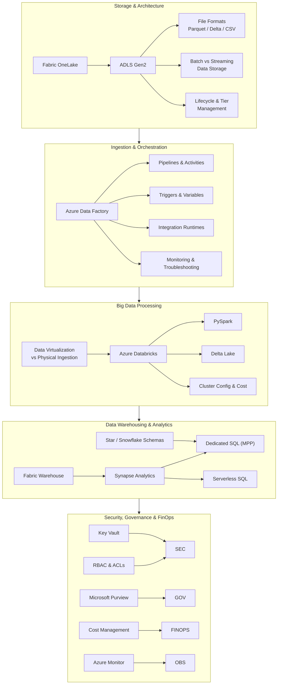

#review: DRAFT

# Azure Data Engineering Training
### 01 — Azure Data Engineering — Research Synthesis

---

## Concept Map & Research Synthesis

### Prerequisites (Not Taught in This Training)

The following topics are expected knowledge for learners entering this training. They are marked as **out of scope** in the source curriculum and should be covered before Day 1:

| Topic | Reason |
|-------|--------|
| Medallion Architecture (Bronze / Silver / Gold) | Foundational data lake pattern — assumed as prerequisite |
| ETL vs ELT fundamentals | Architectural pattern knowledge needed before pipeline building |
| Apache Spark concepts & SQL basics | Required before using Databricks and PySpark |
| Cloud computing fundamentals (IaaS, PaaS, SaaS) | General cloud knowledge expected for Azure service navigation |

### Structured Outline

```
AZURE DATA ENGINEERING
├── Storage & Architecture Foundations
│   ├── ADLS Gen2 (hierarchical namespace, tiers, lifecycle)
│   ├── Batch vs Streaming Data Storage
│   ├── File Formats (Parquet, Delta Lake, CSV, JSON)
│   └── Fabric OneLake (SaaS evolution)
│
├── Ingestion & Orchestration
│   ├── Azure Data Factory (pipelines, activities, triggers)
│   ├── Pipeline monitoring & troubleshooting
│   ├── Integration Runtimes (Azure IR, Self-Hosted IR)
│   └── Batch ingestion patterns
│
├── Big Data Processing & Transformation
│   ├── Azure Databricks (clusters, notebooks, jobs)
│   ├── PySpark for data transformation
│   ├── Data Virtualization vs Physical Ingestion
│   ├── Delta Lake operations
│   └── Cluster configuration & cost optimization
│
├── Enterprise Data Warehousing
│   ├── Synapse Serverless SQL (on-demand query)
│   ├── Synapse Dedicated SQL (DWUs, MPP)
│   ├── Star & Snowflake schemas
│   └── Microsoft Fabric Warehouse
│
├── Security, Governance & Monitoring
│   ├── Azure Key Vault (secrets, connections)
│   ├── RBAC & Data Lake ACLs
│   ├── Microsoft Purview (lineage, catalog)
│   └── Azure Monitor (alerts, diagnostics)
│
└── FinOps & Cost Optimization
    ├── Consumption-based pricing models
    ├── Auto-termination & lifecycle policies
    ├── Spot VMs & reserved capacity
    └── Budget alerts & cost management
```

### Visual Concept Map



---

## Key Insights

1. Azure Data Engineering follows a **decoupled architecture** where storage (ADLS Gen2) and compute (Databricks, Synapse) are independent, enabling cost-efficient scaling and flexible job orchestration.

2. **Batch vs streaming data storage** is a fundamental design decision — engineers must understand when to use each pattern and how Azure services support both modes differently.

3. **FinOps is a core competency** for Azure data engineers — understanding consumption-based pricing, auto-termination policies, and tiered storage is as critical as building pipelines themselves.

4. **Serverless configurations** (ADF Data Flows, Synapse Serverless SQL) offer the most cost-effective path for development and training, with pay-per-execution models that eliminate idle compute costs.

5. **Security integration must happen early** — Key Vault configuration for secrets management should be introduced during pipeline ingestion, not saved as an afterthought in the final modules.

6. **Data Virtualization vs Physical Ingestion** is a key architectural choice — virtualization reduces storage costs and avoids data duplication, while physical ingestion improves query performance at the cost of storage and compute.

7. The training sources strongly emphasize **cost-awareness over feature breadth** — recommending architecture decisions based on commercial viability rather than purely technical capability.

8. **Pipeline monitoring and troubleshooting** is a required skill that spans all phases — learners should practice reading pipeline runs, diagnosing failures, and setting up alerts from the start.

---

## Recommended Architecture for Training

Based on the source materials, the following architecture minimizes cost while maximizing learning value for a 3-week training:

| Layer | Service | Why |
|-------|---------|-----|
| Storage | ADLS Gen2 (Hot/Cool tiers, LRS) | Consumption-based, ~$0.023/GB/month; lifecycle policies automate tier transitions |
| Orchestration | ADF with default IR | Per-execution pricing; debug mode costs ~$0.002 per pipeline run |
| Processing | Databricks with auto-termination (15-min) + Spot VMs | Avoids idle compute; Spot VMs reduce DBU costs by ~50% |
| Ad-hoc Query | Synapse Serverless SQL | Pay per TB scanned (~$5.00/TB); no provisioned infrastructure |
| Visualization | Power BI Desktop (free) | Zero cost for local development |
| Secrets | Azure Key Vault | Fraction-of-a-cent per transaction |

**Avoid for training:** Synapse Dedicated SQL pools (hourly provisioned cost), always-on Databricks clusters, Premium-tier Power BI licenses.

---

## Suggested Topic List

### 3-Week Training (15 Days) — Junior Data Engineers

**Prerequisites to confirm before Day 1:** Medallion Architecture, ETL/ELT fundamentals, Apache Spark & SQL basics, cloud computing fundamentals.

| Day | Topic | Phase | Tag |
|-----|-------|-------|-----|
| 1 | Azure Data Engineering Overview, Cloud & Lakehouse Concepts | Storage & Foundations | — |
| 2 | ADLS Gen2: Storage Tiers, Lifecycle Management & File Formats | Storage & Foundations | — |
| 3 | Batch vs Streaming Data Storage, Data Lake Design & Partitioning | Storage & Foundations | — |
| 4 | Azure Data Factory: Pipelines, Activities & Debugging | Ingestion & Orchestration | — |
| 5 | ADF Triggers, Variables & Integration Runtimes | Ingestion & Orchestration | — |
| 6 | Pipeline Monitoring, Troubleshooting & Batch Ingestion Patterns | Ingestion & Orchestration | — |
| 7 | Azure Databricks Environments & Cluster Configuration | Big Data Processing | — |
| 8 | PySpark Data Transformation with Delta Lake | Big Data Processing | — |
| 9 | Data Virtualization vs Physical Ingestion, Job Clusters & Cost Optimization | Big Data Processing | — |
| 10 | Synapse Analytics: Serverless SQL & Data Virtualization | Warehousing & Analytics | — |
| 11 | Data Warehousing Design (Star Schema) & Dedicated SQL Pools | Warehousing & Analytics | — |
| 12 | Microsoft Fabric: OneLake, Notebooks & Warehouse | Warehousing & Analytics | [GAP] |
| 13 | Security: Key Vault, RBAC, ACLs & Private Endpoints | Security & Governance | — |
| 14 | Governance & FinOps: Purview, Cost Management & Budget Alerts | Security & Governance | — |
| 15 | Capstone: End-to-End Serverless Data Pipeline Project | Capstone | — |

[GAP] — Topic not directly covered in provided sources but included for comprehensive coverage.

---

*Version: v1.0 | Created: 2026-07-06 | Author: Technical Curriculum Designer*

Synthesis complete. Please review the concept map, key insights, and suggested topic list. Confirm, adjust, or add topics before proceeding to Skill 2: Learning Path Architect.
