#review: DRAFT

# Azure Data Engineering Training
### 02 — Azure Data Engineering — Learning Path Architect

---

## Learning Path Skeleton

### Metadata

| Field | Value |
|-------|-------|
| Learning Path Title | Azure Data Engineering Training |
| Training POC | Jem Villanueva |
| Version | v1.0 |
| Date Created | 2026-07-06 |
| Created By | Technical Curriculum Designer |
| Objective | Learners will be able to design, build, and optimize batch data pipelines on Azure using ADLS Gen2, Azure Data Factory, Azure Databricks, and Synapse Analytics while applying FinOps best practices |
| Target Audience | Junior data engineers with foundational data knowledge |
| Knowledge Prerequisites | Medallion Architecture, ETL/ELT fundamentals, Apache Spark & SQL basics, cloud computing fundamentals |
| Tools Needed | Azure subscription (trial or sandbox), ADLS Gen2, ADF, Azure Databricks, Synapse Analytics, Power BI Desktop, Azure Key Vault |
| Total Duration | 15 days (120 hours) |

### Training Timeline

```mermaid
gantt
    title Azure Data Engineering — 3-Week Schedule
    dateFormat D
    axisFormat Day %e
    tickInterval 1day
    weekday monday

    section Storage & Foundations
    Phase 1 (Days 1-3)           :a1, 1, 3d

    section Ingestion & Orchestration
    Phase 2 (Days 4-6)           :a2, 4, 3d

    section Big Data Processing
    Phase 3 (Days 7-9)           :a3, 7, 3d

    section Warehousing & Analytics
    Phase 4 (Days 10-12)         :a4, 10, 3d

    section Security & FinOps
    Phase 5 (Days 13-14)         :a5, 13, 2d

    section Capstone
    Phase 6 (Day 15)             :a6, 15, 1d
```

### Day-by-Day Breakdown

| Day | Topic | Domain | Delivery Method | Est. Time | Hands-On | Visual |
|-----|-------|--------|----------------|-----------|----------|--------|
| 1 | Azure Data Engineering Overview, Cloud & Lakehouse Concepts | Data Engineering | Lecture + Demo | 8h | [THEORY ONLY] | [VISUAL RECOMMENDED] |
| 2 | ADLS Gen2: Storage Tiers, Lifecycle Management & File Formats | Storage | Lecture + Demo | 8h | [HANDS-ON RECOMMENDED] | [VISUAL RECOMMENDED] |
| 3 | Batch vs Streaming Data Storage, Data Lake Design & Partitioning | Storage | Lecture + Workshop | 8h | [HANDS-ON RECOMMENDED] | [VISUAL RECOMMENDED] |
| 4 | Azure Data Factory: Pipelines, Activities & Debugging | Orchestration | Workshop | 8h | [HANDS-ON RECOMMENDED] | [VISUAL RECOMMENDED] |
| 5 | ADF Triggers, Variables & Integration Runtimes | Orchestration | Workshop | 8h | [HANDS-ON RECOMMENDED] | [VISUAL RECOMMENDED] |
| 6 | Pipeline Monitoring, Troubleshooting & Batch Ingestion Patterns | Orchestration | Workshop | 8h | [HANDS-ON RECOMMENDED] | [VISUAL RECOMMENDED] |
| 7 | Azure Databricks Environments & Cluster Configuration | Processing | Lecture + Demo | 8h | [HANDS-ON RECOMMENDED] | [VISUAL RECOMMENDED] |
| 8 | PySpark Data Transformation with Delta Lake | Processing | Workshop | 8h | [HANDS-ON RECOMMENDED] | [VISUAL RECOMMENDED] |
| 9 | Data Virtualization vs Physical Ingestion, Job Clusters & Cost Optimization | Processing | Lecture + Workshop | 8h | [HANDS-ON RECOMMENDED] | [VISUAL RECOMMENDED] |
| 10 | Synapse Analytics: Serverless SQL & Data Virtualization | Warehousing | Workshop | 8h | [HANDS-ON RECOMMENDED] | [VISUAL RECOMMENDED] |
| 11 | Data Warehousing Design (Star Schema) & Dedicated SQL Pools | Warehousing | Lecture + Demo | 8h | [THEORY ONLY] | [VISUAL RECOMMENDED] |
| 12 | Microsoft Fabric: OneLake, Notebooks & Warehouse | Warehousing | Lecture + Demo | 8h | [THEORY ONLY] | [VISUAL RECOMMENDED] |
| 13 | Security: Key Vault, RBAC, ACLs & Private Endpoints | Security | Lecture + Workshop | 8h | [HANDS-ON RECOMMENDED] | [VISUAL RECOMMENDED] |
| 14 | Governance & FinOps: Purview, Cost Management & Budget Alerts | Governance | Lecture + Workshop | 8h | [HANDS-ON RECOMMENDED] | [VISUAL RECOMMENDED] |
| 15 | Capstone: End-to-End Serverless Data Pipeline Project | Capstone | Project | 8h | [HANDS-ON RECOMMENDED] | [NO VISUAL NEEDED] |

### Day Details

#### Day 1 — Azure Data Engineering Overview, Cloud & Lakehouse Concepts
- **Objective:** Describe the Azure data engineering landscape, core services, and the lakehouse architecture pattern.
- **Concepts:**
  - Azure data platform overview (ADLS, ADF, Databricks, Synapse, Fabric)
  - Lakehouse architecture vs traditional data warehouse
  - Batch processing pipeline anatomy
  - Introduction to FinOps and cost-aware engineering
  - Azure portal navigation and resource provisioning
- **Estimated Time:** 8h
- **Hands-On:** [THEORY ONLY]
- **Visual:** [VISUAL RECOMMENDED]

#### Day 2 — ADLS Gen2: Storage Tiers, Lifecycle Management & File Formats
- **Objective:** Provision an ADLS Gen2 storage account and configure storage tiers, lifecycle policies, and file format transformations.
- **Concepts:**
  - Creating ADLS Gen2 with hierarchical namespace
  - Hot, Cool, and Archive tiers
  - Lifecycle management policies
  - Parquet, Delta Lake, CSV, and JSON formats
  - Storage Browser and container management
- **Estimated Time:** 8h
- **Hands-On:** [HANDS-ON RECOMMENDED]
- **Visual:** [VISUAL RECOMMENDED]

#### Day 3 — Batch vs Streaming Data Storage, Data Lake Design & Partitioning
- **Objective:** Design a data lake directory structure with partitioning strategies and evaluate batch versus streaming storage requirements.
- **Concepts:**
  - Batch vs streaming data characteristics
  - Data lake directory naming conventions (Hive-style partitioning)
  - Partition pruning and file size optimization
  - Small file problem and compaction strategies
  - Cost comparison: batch vs streaming storage paths
- **Estimated Time:** 8h
- **Hands-On:** [HANDS-ON RECOMMENDED]
- **Visual:** [VISUAL RECOMMENDED]

#### Day 4 — Azure Data Factory: Pipelines, Activities & Debugging
- **Objective:** Build and debug a basic ADF pipeline with copy activity and dataset configuration.
- **Concepts:**
  - ADF pipeline anatomy (activities, datasets, linked services)
  - Copy Data activity and dataset configuration
  - Source-to-sink mapping
  - Pipeline debugging and output validation
  - Integration Runtime types (Azure IR, Self-Hosted IR)
- **Estimated Time:** 8h
- **Hands-On:** [HANDS-ON RECOMMENDED]
- **Visual:** [VISUAL RECOMMENDED]

#### Day 5 — ADF Triggers, Variables & Integration Runtimes
- **Objective:** Configure schedule and event-based triggers, parameterize pipelines with variables, and manage Integration Runtimes.
- **Concepts:**
  - Schedule, tumbling window, and event-based triggers
  - Pipeline parameters and global variables
  - Dynamic expressions and functions
  - Self-Hosted IR setup for on-premises connectivity
  - Security: managed identity and Key Vault integration
- **Estimated Time:** 8h
- **Hands-On:** [HANDS-ON RECOMMENDED]
- **Visual:** [VISUAL RECOMMENDED]

#### Day 6 — Pipeline Monitoring, Troubleshooting & Batch Ingestion Patterns
- **Objective:** Monitor ADF pipeline runs, diagnose failures, and implement batch ingestion patterns for incremental and full loads.
- **Concepts:**
  - ADF Monitor hub and pipeline run views
  - Activity run logs and error diagnostics
  - Alert rules on pipeline failures
  - Full load vs incremental load patterns
  - Watermark tables for change tracking
- **Estimated Time:** 8h
- **Hands-On:** [HANDS-ON RECOMMENDED]
- **Visual:** [VISUAL RECOMMENDED]

#### Day 7 — Azure Databricks Environments & Cluster Configuration
- **Objective:** Set up an Azure Databricks workspace, configure clusters with auto-termination policies, and navigate the notebook environment.
- **Concepts:**
  - Azure Databricks workspace creation and administration
  - Cluster types (Interactive, Job, Single-Node)
  - Databricks Runtime and auto-termination policies
  - Notebook basics: cells, languages, magic commands
  - Cluster cost optimization (Spot VMs, auto-scaling)
- **Estimated Time:** 8h
- **Hands-On:** [HANDS-ON RECOMMENDED]
- **Visual:** [VISUAL RECOMMENDED]

#### Day 8 — PySpark Data Transformation with Delta Lake
- **Objective:** Write PySpark transformations using DataFrames and Delta Lake operations to read, clean, and write batch data.
- **Concepts:**
  - PySpark DataFrame API (read, write, filter, group, join)
  - Delta Lake: ACID transactions, time travel, schema enforcement
  - Bronze/Silver/Gold medallion implementation in notebooks
  - Optimizations: Z-ordering, optimize, vacuum
  - Writing DataFrames to Delta tables
- **Estimated Time:** 8h
- **Hands-On:** [HANDS-ON RECOMMENDED]
- **Visual:** [VISUAL RECOMMENDED]

#### Day 9 — Data Virtualization vs Physical Ingestion, Job Clusters & Cost Optimization
- **Objective:** Compare data virtualization and physical ingestion strategies, and configure Databricks Job clusters for production pipelines.
- **Concepts:**
  - Data Virtualization: querying external sources without ingestion
  - Physical Ingestion: copying data into Delta Lake
  - Trade-offs: query performance vs storage cost vs freshness
  - Databricks Jobs and Job clusters
  - Comparing costs: virtualization vs ingestion for training workloads
- **Estimated Time:** 8h
- **Hands-On:** [HANDS-ON RECOMMENDED]
- **Visual:** [VISUAL RECOMMENDED]

#### Day 10 — Synapse Analytics: Serverless SQL & Data Virtualization
- **Objective:** Query data lakes using Synapse Serverless SQL and practice data virtualization without provisioning dedicated infrastructure.
- **Concepts:**
  - Synapse Analytics workspace overview
  - Serverless SQL pool: OPENROWSET, CETAS, external tables
  - Querying Parquet and Delta files directly
  - Data virtualization with Synapse Serverless
  - Cost model: ~$5.00 per TB scanned
- **Estimated Time:** 8h
- **Hands-On:** [HANDS-ON RECOMMENDED]
- **Visual:** [VISUAL RECOMMENDED]

#### Day 11 — Data Warehousing Design (Star Schema) & Dedicated SQL Pools
- **Objective:** Design a star schema data warehouse and provision a Synapse Dedicated SQL pool with appropriate distribution strategies.
- **Concepts:**
  - Star schema: fact and dimension tables
  - MPP architecture and data distributions (hash, round-robin, replicated)
  - Synapse Dedicated SQL pool provisioning and DWU scaling
  - Table creation with distribution and indexing options
  - Cost comparison: dedicated vs serverless for training
- **Estimated Time:** 8h
- **Hands-On:** [THEORY ONLY]
- **Visual:** [VISUAL RECOMMENDED]

#### Day 12 — Microsoft Fabric: OneLake, Notebooks & Warehouse
- **Objective:** Navigate the Microsoft Fabric environment and compare its OneLake, Notebooks, and Warehouse capabilities with traditional Azure services.
- **Concepts:**
  - Microsoft Fabric architecture and licensing (F SKUs)
  - OneLake as a unified data lake
  - Fabric Notebooks and Data Factory integration
  - Fabric Warehouse and SQL analytics endpoints
  - Fabric vs traditional Azure services: when to use which
- **Estimated Time:** 8h
- **Hands-On:** [THEORY ONLY]
- **Visual:** [VISUAL RECOMMENDED]

#### Day 13 — Security: Key Vault, RBAC, ACLs & Private Endpoints
- **Objective:** Configure Azure Key Vault for secrets management, assign RBAC roles, and set up managed private endpoints for secure data access.
- **Concepts:**
  - Azure Key Vault: secrets, keys, certificates
  - RBAC roles for ADLS, ADF, and Databricks
  - Data Lake ACLs (POSIX-style permissions)
  - Managed private endpoints and VNet integration
  - Key Vault linked services in ADF and Databricks
- **Estimated Time:** 8h
- **Hands-On:** [HANDS-ON RECOMMENDED]
- **Visual:** [VISUAL RECOMMENDED]

#### Day 14 — Governance & FinOps: Purview, Cost Management & Budget Alerts
- **Objective:** Register data assets in Microsoft Purview, configure Azure Cost Management budgets, and apply cost optimization strategies.
- **Concepts:**
  - Microsoft Purview: data catalog, lineage, scanning
  - Azure Cost Management: budgets, alerts, cost analysis
  - Tagging resources for cost allocation
  - Reserved capacity vs pay-as-you-go decisions
  - Building a FinOps report for a data pipeline
- **Estimated Time:** 8h
- **Hands-On:** [HANDS-ON RECOMMENDED]
- **Visual:** [VISUAL RECOMMENDED]

#### Day 15 — Capstone: End-to-End Serverless Data Pipeline Project
- **Objective:** Build a complete serverless batch data pipeline using all services covered in the training, from ingestion to visualization.
- **Concepts:**
  - Full pipeline: source → ADLS → ADF → Databricks → Synapse → Power BI
  - Applying FinOps: auto-termination, serverless pricing, cost tracking
  - Pipeline monitoring and alert configuration
  - Documentation and architecture diagram
  - Presenting cost analysis alongside technical implementation
- **Estimated Time:** 8h
- **Hands-On:** [HANDS-ON RECOMMENDED]
- **Visual:** [NO VISUAL NEEDED]

---

### Visual Decision Gate

All days except Day 15 (Capstone) have been flagged as [VISUAL RECOMMENDED]. The following visual types are suggested:

| Day | Topic | Suggested Visual Type |
|-----|-------|-----------------------|
| 1 | Overview & Architecture | Architecture diagram (Azure services overview) |
| 2 | ADLS Gen2 & File Formats | Architecture diagram (storage hierarchy) |
| 3 | Data Lake Design | Flowchart (design decision tree) |
| 4 | ADF Pipelines | Flowchart (pipeline activity flow) |
| 5 | ADF Triggers & IR | Flowchart (trigger-to-execution flow) |
| 6 | Monitoring & Ingestion | Concept map (batch patterns) |
| 7 | Databricks Environments | Architecture diagram (workspace/cluster layout) |
| 8 | PySpark & Delta Lake | Flowchart (transformation pipeline) |
| 9 | Virtualization vs Ingestion | Comparison diagram (decision matrix) |
| 10 | Synapse Serverless | Architecture diagram (serverless query flow) |
| 11 | Star Schema & DW | Concept map (star schema structure) |
| 12 | Microsoft Fabric | Architecture diagram (Fabric services) |
| 13 | Security | Concept map (security layers) |
| 14 | Governance & FinOps | Flowchart (FinOps lifecycle) |
| 15 | Capstone | — |

Please confirm which visual flags to keep, remove, or adjust before proceeding to Skill 3.

---

*Version: v1.0 | Created: 2026-07-06 | Author: Technical Curriculum Designer*

Learning path skeleton complete. Please review the structure, day breakdown, and visual flags. Confirm, adjust, or add changes before proceeding to Skill 3: Module Content Builder.

