#review: APPROVED
---
tags:
  topic-slug: azure-data-engineering
  skill-domains: [data-engineering, cloud-computing, data-pipelines, data-warehousing]
  audience: junior-data-engineers
  difficulty: beginner
  delivery-methods: [lecture, workshop, hands-on-lab, project]
  total-days: 15
  status: draft
  dataset: Kaggle Climate Change Global Temperature Data (https://www.kaggle.com/datasets/sachinsarkar/climate-change-global-temperature-data)
---

# Azure Data Engineering Training
### 03 — Azure Data Engineering — Module Content

---

## Metadata

| Field | Value |
|-------|-------|
| **Title** | Azure Data Engineering Training |
| **Version** | v1.0 |
| **Date Created** | 2026-07-06 |
| **Author** | Technical Curriculum Designer |
| **Target Audience** | Junior data engineers with foundational data knowledge |
| **Knowledge Prerequisites** | Medallion Architecture, ETL/ELT fundamentals, Apache Spark & SQL basics, cloud computing fundamentals |
| **Tools Needed** | Azure subscription (trial or sandbox), ADLS Gen2, Azure Data Factory, Azure Databricks, Synapse Analytics, Power BI Desktop, Azure Key Vault |
| **Skill Domains** | Storage, Orchestration, Big Data Processing, Warehousing, Security, Governance, FinOps |
| **Dataset Reference** | [Climate Change Global Temperature Data](https://www.kaggle.com/datasets/sachinsarkar/climate-change-global-temperature-data) — Kaggle, derived from Berkeley Earth (CC BY-NC 4.0) |
| **Total Duration** | 15 days / 120 hours |
| **Suggested Pace** | 8 hours per day — mix of lecture, workshop, and hands-on lab |

---

## Training Timeline

```mermaid
gantt
    title Azure Data Engineering — 3-Week Schedule
    dateFormat D
    axisFormat Day %e
    tickInterval 1day
    weekday monday

    section Storage & Foundations
    Days 1-3          :a1, 1, 3d

    section Ingestion & Orchestration
    Days 4-6          :a2, 4, 3d

    section Big Data Processing
    Days 7-9          :a3, 7, 3d

    section Warehousing & Analytics
    Days 10-12        :a4, 10, 3d

    section Security & FinOps
    Days 13-14        :a5, 13, 2d

    section Capstone
    Day 15            :a6, 15, 1d
```



---

## Module Content

---

#### Day 1: Azure Data Engineering Overview, Cloud & Lakehouse Concepts

- **Learning Objective:** Describe the Azure data engineering landscape, core services, and the lakehouse architecture pattern.
- **Core Idea:** The modern Azure data ecosystem is composed of specialized PaaS services (ADLS Gen2, ADF, Databricks, Synapse) converging toward a unified SaaS platform (Microsoft Fabric). Each service targets a distinct phase of the data lifecycle — storage, ingestion, transformation, warehousing, and analytics — and engineers must understand how these services interconnect to build reliable pipelines.
- **Why It Matters:** Junior engineers entering Azure environments encounter a fragmented toolset where choosing the wrong service or architecture pattern leads to excessive costs, poor performance, and maintenance overhead. Understanding the landscape prevents costly architectural rewrites and enables engineers to make informed design decisions from the start.
- **How It Works:** A batch data pipeline flows sequentially through storage (ADLS Gen2), orchestration (ADF), processing (Databricks or Synapse Spark), serving (Synapse SQL or Fabric), and visualization (Power BI). Cost-aware design principles — such as decoupling storage from compute and using serverless configurations — apply at every layer to minimize operational spend.
- **Supplemental Reading:**
  - 📄 [Official Documentation — Azure Data Lake Storage Gen2 Introduction]: https://learn.microsoft.com/en-us/azure/storage/blobs/data-lake-storage-introduction

- **Hands-on Activity:** *(Not applicable — theory day.)*
- **Visual Aid:** ✅ Yes — Architecture diagram showing the Azure data ecosystem: ADLS Gen2, ADF, Databricks, Synapse, Fabric, and Power BI with data flow arrows.

  > This architecture diagram illustrates the end-to-end Azure data engineering ecosystem. Data flows from sources through Azure Data Factory (ingestion) into ADLS Gen2 (storage), then to Azure Databricks (processing) and Synapse Analytics (warehousing), and finally to Power BI (visualization). Security and governance are provided by Azure Key Vault and Microsoft Purview, while Azure Monitor handles observability across all layers.

  ```mermaid
  graph LR
      subgraph "Sources"
          ONPREM["On-Premises Databases"]
          SAAS["SaaS Applications"]
          APIS["APIs & Event Hubs"]
      end

      subgraph "Ingestion & Orchestration"
          ADF["Azure Data Factory"]
      end

      subgraph "Storage"
          ADLS["ADLS Gen2<br/>Hierarchical Namespace"]
      end

      subgraph "Processing & Transformation"
          DB["Azure Databricks<br/>Apache Spark"]
          SYNAPSE["Azure Synapse Analytics"]
      end

      subgraph "Visualization"
          PBI["Power BI"]
      end

      subgraph "Security & Governance"
          KV["Azure Key Vault"]
          PURVIEW["Microsoft Purview"]
      end

      subgraph "Monitoring"
          MONITOR["Azure Monitor"]
      end

      ONPREM --> ADF
      SAAS --> ADF
      APIS --> ADF
      ADF --> ADLS
      ADLS --> DB
      ADLS --> SYNAPSE
      DB --> SYNAPSE
      SYNAPSE --> PBI
      KV -.->|secrets| ADF
      KV -.->|secrets| DB
      PURVIEW -.->|lineage| ADLS
      MONITOR -.->|alerts| ADF
  ```

---

#### Day 2: ADLS Gen2 — Storage Tiers, Lifecycle Management & File Formats

- **Learning Objective:** Provision an ADLS Gen2 storage account and configure storage tiers, lifecycle policies, and file format transformations.
- **Core Idea:** ADLS Gen2 combines the low-cost scalability of Azure Blob Storage with a Hierarchical Namespace (HNS) that organizes files into true directory structures. This HNS capability dramatically accelerates file system operations for analytics engines by enabling atomic directory renames and efficient partition pruning natively at the storage layer.
- **Why It Matters:** Storage is the foundation of every data pipeline — misconfigured storage tiers or poorly chosen file formats cascade cost and performance issues into every downstream phase. Engineers who master ADLS Gen2 provisioning, lifecycle policy automation, and format selection prevent the most common sources of data lake degradation.
- **How It Works:** Storage accounts with HNS enabled allow data to be organized in directory trees rather than flat blob key prefixes. Data moves automatically across Hot, Cool, and Archive tiers through lifecycle management policies triggered on age or modification timestamps. File formats such as Parquet (columnar, compressed) and Delta Lake (Parquet + transaction log) optimize storage for analytics workloads.
- **Supplemental Reading:**
  - 📄 [Official Documentation — Blob Storage Lifecycle Management]: https://learn.microsoft.com/en-us/azure/storage/blobs/storage-lifecycle-management-concepts
- **Hands-on Activity:** **Provision ADLS Gen2 and Stage Raw Data** — Learners create a storage account with HNS enabled, configure Hot → Cool lifecycle policies, upload the Kaggle climate temperature CSV (`GlobalTemperatures.csv`) to a `bronze/` container, and inspect the HNS directory structure using Storage Browser. The output is a configured storage layer ready for the Day 3 hands-on.
- **Visual Aid:** ✅ Yes — Architecture diagram showing ADLS Gen2 hierarchy: Blob ↔ HNS, Hot/Cool/Archive tiers, lifecycle policy flow arrows.

  > This diagram shows the structure of an ADLS Gen2 storage account with Hierarchical Namespace enabled. Data is organized into directories and containers, with lifecycle policies automatically transitioning data across Hot, Cool, and Archive tiers. Supported file formats include CSV, Parquet, and Delta Lake (Parquet with a transaction log).

  ```mermaid
  graph TD
      subgraph "ADLS Gen2 Storage Account"
          HNS["Hierarchical Namespace (HNS)"]
           CONTAINER["Container: climatedata"]
          CONTAINER --> DIR1["bronze/"]
          CONTAINER --> DIR2["silver/"]
          CONTAINER --> DIR3["gold/"]
      end

      subgraph "Access Tiers"
          HOT["Hot Tier<br/>~$0.023/GB/month"]
          COOL["Cool Tier<br/>~$0.0125/GB/month"]
          ARCHIVE["Archive Tier<br/>~$0.002/GB/month"]
      end

      subgraph "Lifecycle Management"
          POLICY["Lifecycle Policy"]
          POLICY -->|"age > 30 days"| HOT2COOL["Hot → Cool"]
          POLICY -->|"age > 90 days"| COOL2ARCHIVE["Cool → Archive"]
      end

      subgraph "File Formats"
          CSV["CSV (Row-based)"]
          PARQUET["Parquet (Columnar)"]
          DELTA["Delta Lake<br/>Parquet + _delta_log"]
      end

      DIR1 --> CSV
      DIR2 --> PARQUET
      DIR3 --> DELTA
      HNS --> CONTAINER
      HOT --> COOL
      COOL --> ARCHIVE
  ```

---

#### Day 3: Batch vs Streaming Data Storage, Data Lake Design & Partitioning

- **Learning Objective:** Design a data lake directory structure with Hive-style partitioning strategies and evaluate batch versus streaming storage requirements.
- **Core Idea:** Data lake directory design directly determines query performance and cost. Hive-style partitioning (e.g., `year=2026/month=07/day=06/`) enables partition pruning, where query engines skip irrelevant directories entirely rather than scanning the full dataset. The small file problem — millions of tiny files overwhelming compute master nodes — must be mitigated through compaction strategies that merge files into 128MB–512MB blocks.
- **Why It Matters:** Unstructured data lakes with no partitioning strategy become unqueryable as they grow — every scan reads the entire dataset, driving up Synapse Serverless and Databricks costs linearly with data volume. Engineers who design partitioning and compaction plans upfront protect pipeline performance and keep query costs predictable.
- **How It Works:** Data arrives in either batch (scheduled bulk transfers at regular intervals) or streaming (continuous event ingestion). For batch pipelines, directory structures follow `/{source}/{layer}/{key=value}/` conventions that allow downstream engines to prune partitions automatically. Compaction routines run as scheduled ADF pipelines or Databricks jobs, merging fragmented files into optimized Parquet blocks.
- **Supplemental Reading:**
  - 📄 [Official Documentation — Data Lake Storage Best Practices]: https://learn.microsoft.com/en-us/azure/storage/blobs/data-lake-storage-best-practices
  - 📝 [The Small File Problem in Data Lakes]: https://alper-korukcu.medium.com/small-files-big-problems-the-silent-killer-of-data-lake-performance-a448db657c94

- **Hands-on Activity:** **Design Partitioned Layout and Convert to Parquet** — Using the Day 2 storage account, learners design a Hive-partitioned directory structure under `silver/climate/year=*/` using the `dt` column from `GlobalTemperatures.csv`, load a subset of the Kaggle dataset into the partitioned directory, and convert CSV to Parquet format using ADF Copy Activity. The output is a partitioned Silver layer ready for Day 4 pipeline orchestration.
- **Visual Aid:** ✅ Yes — Flowchart showing data lake directory tree with Hive-style partition path and leaf files.

  > This flowchart shows the data lake directory design process, starting with the batch vs streaming decision. The batch path follows Hive-style partitioning (`source/layer/year=YYYY/month=MM/day=DD/`) and includes compaction logic to address the small file problem. The streaming path routes to event-based storage for continuous ingestion.

  ```mermaid
  graph TD
      DECISION["Data Source Type?"]
      BATCH["Batch Data<br/>Scheduled intervals"]
      STREAMING["Streaming Data<br/>Continuous events"]
      
      subgraph "Batch Path"
          HIVE["Hive-Style Partitioning<br/>source/layer/year=*/month=*/"]
          PARTITION["Partition Pruning<br/>Skip irrelevant directories"]
          SMALL["Small File Problem?"]
          COMPACT["Run Compaction<br/>Merge to 128-512MB blocks"]
          QUERY["Optimized Query Performance"]
      end

      subgraph "Streaming Path"
          EVENTS["Event Hubs / IoT Hub"]
          STORAGE["Stream-Storage<br/>Append blobs"]
      end

      DECISION -->|"Batch"| BATCH
      DECISION -->|"Streaming"| STREAMING
      BATCH --> HIVE
      HIVE --> PARTITION
      PARTITION --> SMALL
      SMALL -->|"Yes"| COMPACT
      SMALL -->|"No"| QUERY
      COMPACT --> QUERY
      STREAMING --> EVENTS
      EVENTS --> STORAGE
  ```

---

#### Day 4: Azure Data Factory — Pipelines, Activities & Debugging

- **Learning Objective:** Build and debug a basic ADF pipeline with copy activity and dataset configuration.
- **Core Idea:** Azure Data Factory is a serverless visual data integration service where pipelines are composed of linked services (connection strings), datasets (structural references to data), and activities (execution actions such as Copy, Web, and Execute Notebook). Integration Runtimes (IR) handle connectivity — Azure IR for cloud-to-cloud, Self-Hosted IR for on-premises sources behind firewalls.
- **Why It Matters:** ADF is the central orchestration hub in most Azure data environments — nearly every pipeline begins or passes through an ADF activity. Engineers who cannot build, parameterize, and debug ADF pipelines effectively cannot deploy production data workflows reliably.
- **How It Works:** A pipeline begins at a trigger, executes activities in dependency order, and logs each run to the ADF Monitor hub. The Copy activity moves data between a source and sink linked service, handling format conversion, schema mapping, and fault tolerance. Debug mode runs a pipeline on-demand without requiring a published trigger, enabling rapid iteration during development.
- **Supplemental Reading:**
  - 📄 [Official Documentation — Azure Data Factory Introduction]: https://learn.microsoft.com/en-us/azure/data-factory/introduction
  - 📄 [Official Documentation — ADF Quickstart]: https://learn.microsoft.com/en-us/azure/data-factory/quickstart-create-data-factory-portal
  - 📄 [Official Documentation — ADF Visual Authoring]: https://learn.microsoft.com/en-us/azure/data-factory/author-visually

- **Hands-on Activity:** **Build ADF Pipeline for Bronze Ingestion** — Learners create an ADF instance, configure linked services pointing to the Day 2 storage account, build a Copy Data pipeline that moves the raw CSV from `bronze/` to a staging location, run debug mode, and validate output in Storage Browser. The output is a reusable pipeline that feeds the Day 5 parameterization exercise.
- **Visual Aid:** ✅ Yes — Flowchart diagram showing ADF pipeline activity flow: Trigger → Copy Activity → Sink with dependency chains.

  > This flowchart shows the structure of an Azure Data Factory pipeline. A trigger initiates execution, the pipeline runs activities in dependency order with linked services and datasets defining connections and data references. Integration Runtimes handle connectivity, and each run is logged to the Monitor hub for debugging and validation.

  ```mermaid
  graph LR
      TRIGGER["Trigger<br/>Schedule / Event / Tumbling"]
      PIPELINE["ADF Pipeline"]
      
      subgraph "Activities"
          COPY["Copy Data<br/>Source → Sink"]
          WEB["Web Activity"]
          NOTEBOOK["Execute Notebook"]
      end

      subgraph "Connectivity"
          LS["Linked Service<br/>Connection String"]
          DS["Dataset<br/>Data Reference"]
          IR["Integration Runtime<br/>Azure IR / SHIR"]
      end

      subgraph "Monitoring"
          MONITOR["Monitor Hub"]
          LOGS["Activity Run Logs"]
          ERRORS["Error Messages"]
      end

      TRIGGER --> PIPELINE
      PIPELINE --> COPY
      PIPELINE --> WEB
      PIPELINE --> NOTEBOOK
      COPY --> LS
      COPY --> DS
      LS --> IR
      PIPELINE --> MONITOR
      MONITOR --> LOGS
      MONITOR --> ERRORS
  ```

---

#### Day 5: ADF Triggers, Variables & Integration Runtimes

- **Learning Objective:** Configure schedule and event-based triggers, parameterize pipelines with variables, and manage Integration Runtimes.
- **Core Idea:** ADF triggers automate pipeline execution through three mechanisms — Schedule triggers (clock-based intervals), Tumbling Window triggers (non-overlapping historical windows with retry and dependency support), and Event triggers (reactive execution on storage events such as blob creation). Parameterizing pipelines with variables allows a single pipeline definition to orchestrate ingestion across hundreds of different sources dynamically.
- **Why It Matters:** Manual pipeline execution does not scale — production environments require automated, reliable scheduling that handles retries, backfills, and cross-pipeline dependencies. Parameterization prevents pipeline duplication by enabling a single template to handle multiple sources with different connection details and schedules.
- **How It Works:** Variables are defined at the pipeline level and referenced using dynamic expressions (`@pipeline().parameters.paramName`). Tumbling Window triggers maintain strict time boundaries, automatically backfilling missed windows on recovery. Self-Hosted IRs are installed on premises to bridge hybrid network environments, connecting to databases that cannot be exposed to the public internet.
- **Supplemental Reading:**
  - 📄 [Official Documentation — ADF Pipelines and Triggers]: https://learn.microsoft.com/en-us/azure/data-factory/concepts-pipeline-execution-triggers
  - 📝 [Integration Runtime in Azure Data Factory]: https://learn.microsoft.com/en-us/azure/data-factory/concepts-integration-runtime
  - 📄 [Official Documentation — ADF Expression Functions]: https://learn.microsoft.com/en-us/azure/data-factory/how-to-expression-language-functions

- **Hands-on Activity:** **Parameterize Pipeline and Add Tumbling Window Trigger** — Learners take the Day 4 pipeline and add parameters for source file path and year filter, create a tumbling window trigger that runs daily, integrate Key Vault for the storage account key (preview of Day 13), and test backfill execution. The output is a parameterized, scheduled pipeline that feeds the Day 6 monitoring exercise.
- **Visual Aid:** ✅ Yes — Flowchart showing trigger-to-execution: Trigger → Pipeline → Parameterized Activities → Sink with dynamic expression callout.

  > This flowchart illustrates how ADF triggers initiate pipeline execution. Schedule triggers run on clock intervals, Tumbling Window triggers maintain non-overlapping historical windows with built-in retry, and Event triggers react to storage blob creation. Parameters and variables are passed dynamically into pipeline activities.

  ```mermaid
  graph TD
      subgraph "Trigger Types"
          SCHEDULE["Schedule Trigger<br/>Every 24 hours"]
          TW["Tumbling Window Trigger<br/>Non-overlapping windows"]
          EVENT["Event Trigger<br/>Blob created"]
      end

      subgraph "Pipeline Execution"
          PARAMS["Pipeline Parameters<br/>@pipeline().parameters"]
          VARS["Variables"]
          ACTIVITIES["Activities<br/>Copy / Web / Notebook"]
      end

      subgraph "Integration Runtimes"
          AIR["Azure IR<br/>Cloud-to-cloud"]
          SHIR["Self-Hosted IR<br/>On-premises gateway"]
      end

      subgraph "Output"
          SINK["ADLS Gen2 Sink"]
          LOGS["Execution Logs"]
      end

      SCHEDULE --> PARAMS
      TW --> PARAMS
      EVENT --> PARAMS
      PARAMS --> ACTIVITIES
      VARS --> ACTIVITIES
      ACTIVITIES --> AIR
      ACTIVITIES --> SHIR
      AIR --> SINK
      SHIR --> SINK
      ACTIVITIES --> LOGS
  ```

---

#### Day 6: Pipeline Monitoring, Troubleshooting & Batch Ingestion Patterns

- **Learning Objective:** Monitor ADF pipeline runs, diagnose failures, and implement batch ingestion patterns for incremental and full loads.
- **Core Idea:** ADF Monitor hub provides a centralized view of all pipeline runs, activity runs, and trigger executions. Engineers diagnose failures by inspecting activity run logs, error messages, and input/output payloads. Incremental ingestion uses a watermark table — a control table that tracks the last successfully processed timestamp or ID — enabling pipelines to extract only new or changed records since the last run rather than reloading entire datasets.
- **Why It Matters:** Pipeline failures are inevitable in production — undiagnosed failures cascade data gaps into downstream reports and models. Incremental ingestion is a mandatory pattern at enterprise scale because full reloads become cost-prohibitive and time-out risk increases as datasets grow into terabytes.
- **How It Works:** ADF Monitor shows status (Succeeded, Failed, In Progress, Cancelled), duration, and row counts per activity. Alert rules fire on failure events, sending email or webhook notifications to operations teams. Watermark tables store a single row with `last_processed_timestamp`; pipelines read this value, extract data where modified timestamps exceed it, and update the watermark on successful completion.
- **Supplemental Reading:**
  - 📄 [Official Documentation — Monitor ADF Pipelines]: https://learn.microsoft.com/en-us/azure/data-factory/monitor-visually
  - 📄 [Official Documentation — Incremental Copy Tutorial]: https://learn.microsoft.com/en-us/azure/data-factory/tutorial-incremental-copy-portal

- **Hands-on Activity:** **Create Failure Alert and Build Watermark Table** — Learners set up email alerts on the Day 5 pipeline, intentionally introduce a failure (wrong file path), diagnose the error in Monitor hub, then implement a watermark table in ADLS (stored as JSON) that tracks last processed date, and modify the pipeline to read only new records since the watermark timestamp using the Kaggle dataset ingestion. The output is a monitored, incremental-load pipeline feeding the Day 7 Databricks workspace.
- **Visual Aid:** ✅ Yes — Concept map showing batch ingestion patterns: full load, incremental load with watermark, upsert with merge.

  > This concept map shows the three key areas of Day 6 learning: monitoring via ADF Monitor hub and alert rules, troubleshooting through activity log analysis, and batch ingestion patterns including full load, incremental load with watermark tables, and upsert using Delta Lake merge operations.

  ```mermaid
  graph TD
      MONITORING["Pipeline Monitoring<br/>& Troubleshooting"]
      
      subgraph "Monitor"
          MHUB["ADF Monitor Hub"]
          STATUS["Run Status<br/>Succeeded / Failed"]
          ALERTS["Alert Rules<br/>Email / Webhook"]
      end

      subgraph "Troubleshoot"
          LOGS["Activity Run Logs"]
          DIAG["Error Diagnostics"]
          RETRY["Retry Policies"]
      end

      subgraph "Ingestion Patterns"
          FULL["Full Load<br/>Reload entire table"]
          INCREMENTAL["Incremental Load<br/>Watermark table"]
          UPSERT["Upsert / Merge<br/>Delta Lake MERGE"]
      end

      subgraph "Watermark Mechanism"
          WT["Watermark Table<br/>last_processed_timestamp"]
          EXTRACT["Extract WHERE timestamp > watermark"]
          UPDATE["Update watermark on success"]
      end

      MONITORING --> MONITOR
      MONITORING --> Troubleshoot
      MONITORING --> INCREMENTAL
      FULL --> INCREMENTAL
      INCREMENTAL --> UPSERT
      INCREMENTAL --> WT
      WT --> EXTRACT
      EXTRACT --> UPDATE
  ```

---

#### Day 7: Azure Databricks Environments & Cluster Configuration

- **Learning Objective:** Set up an Azure Databricks workspace, configure clusters with auto-termination policies, and navigate the notebook environment.
- **Core Idea:** Azure Databricks provides a managed Apache Spark platform with two cluster types — Interactive clusters for ad-hoc development and exploration (higher cost, manually managed) and Job clusters for production execution (auto-provisioned on schedule, lower cost, terminate immediately after completion). Cluster costs are the largest variable expense in data pipelines, making FinOps configuration — auto-termination timers, Spot VM usage, and right-sizing — a critical engineering skill.
- **Why It Matters:** Untracked Databricks clusters left running idle overnight or over weekends generate enormous waste — a single interactive cluster running 24/7 can cost more than the entire storage layer per month. Engineers must embed cost governance into cluster configuration from the first notebook execution.
- **How It Works:** Clusters are defined by Databricks Runtime version, node type (memory-optimized or compute-optimized), Spot vs on-demand VM selection, auto-scaling range, and auto-termination idle timeout. Interactive clusters mount ADLS Gen2 via service principal credentials for data access. Job clusters are defined inside the Job scheduler, spinning up only for the script duration and shutting down automatically.
- **Supplemental Reading:**
  - 📄 [Official Documentation — Azure Databricks Architecture Guide]: https://learn.microsoft.com/en-us/azure/databricks/introduction/
  - 📝 [Databricks Cost Optimization on Azure]: https://learn.microsoft.com/en-us/azure/databricks/lakehouse-architecture/cost-optimization

- **Hands-on Activity:** **Create Databricks Workspace and Mount ADLS** — Learners provision a Databricks workspace, create an interactive cluster with 20-minute auto-termination and Spot VMs, mount the Day 2 ADLS Gen2 account to DBFS using service principal credentials, and navigate the notebook interface. The output is a configured Databricks environment with mounted storage ready for the Day 8 PySpark exercise.
- **Visual Aid:** ✅ Yes — Architecture diagram showing Databricks workspace layout: workspace → clusters (interactive vs job) → notebooks → ADLS mount.

  > This architecture diagram shows the Azure Databricks workspace structure. Users create Interactive clusters for ad-hoc development (with auto-termination and Spot VMs for cost control) and Job clusters for production execution. Clusters mount ADLS Gen2 via service principal credentials, and notebooks run PySpark code against the mounted data.

  ```mermaid
  graph TD
      subgraph "Azure Databricks Workspace"
          WS["Databricks Workspace"]
      end

      subgraph "Cluster Types"
          INTERACTIVE["Interactive Cluster<br/>Manual start/stop<br/>Higher cost"]
          JOB["Job Cluster<br/>Auto-provisioned<br/>Lower cost"]
      end

      subgraph "Cost Optimization"
          TERM["Auto-Termination<br/>20-min idle timeout"]
          SPOT["Spot VMs<br/>Up to 80% discount"]
          SCALE["Auto-Scaling<br/>2-8 nodes"]
      end

      subgraph "Data Access"
          MOUNT["ADLS Mount<br/>/mnt/weatherdata"]
          SP["Service Principal<br/>Azure AD Auth"]
      end

      subgraph "Notebooks"
          NB1["Ingestion Notebook"]
          NB2["Transform Notebook"]
          NB3["Aggregation Notebook"]
      end

      WS --> INTERACTIVE
      WS --> JOB
      INTERACTIVE --> TERM
      INTERACTIVE --> SPOT
      JOB --> SCALE
      INTERACTIVE --> MOUNT
      JOB --> MOUNT
      MOUNT --> SP
      INTERACTIVE --> NB1
      INTERACTIVE --> NB2
      JOB --> NB3
  ```

---

#### Day 8: PySpark Data Transformation with Delta Lake

- **Learning Objective:** Write PySpark transformations using DataFrames and Delta Lake operations to read, clean, and write batch data.
- **Core Idea:** PySpark DataFrames operate on Spark's lazy evaluation engine, where transformations are compiled into an optimized execution plan by the Catalyst Optimizer before any data is read. Delta Lake adds a transaction log (`_delta_log` directory) over Parquet files, providing ACID transactions, time travel (querying table states by version ID or timestamp), and schema enforcement for data lake reliability.
- **Why It Matters:** Raw data from ingestion pipelines is rarely query-ready — it contains nulls, inconsistent formats, duplicate records, and structural variations. Engineers must apply scalable, repeatable transformations that produce clean, reliable datasets while maintaining full auditability of how data changed over time.
- **How It Works:** A PySpark notebook reads source files from mounted ADLS into DataFrames, applies filter/select/groupBy/join transformations, and writes results to Delta tables. The Delta transaction log records each write operation as a JSON entry — enabling time travel queries (`SELECT * FROM table VERSION AS OF 5`), rollback, and concurrent write conflict resolution. Periodic `OPTIMIZE` commands compact small files, `ZORDER BY` co-locates related column data, and `VACUUM` purges unreferenced file versions beyond a retention threshold.
- **Supplemental Reading:**
  - 📄 [Official Documentation — Delta Lake on Azure Databricks]: https://learn.microsoft.com/en-us/azure/databricks/delta/

 - **Hands-on Activity:** **Transform Climate Data with PySpark and Delta Lake** — Learners read the raw `GlobalTemperatures.csv` from the ADLS mount, clean null values and uncertainty columns, enforce schema, write to a Bronze Delta table, read Bronze and apply de-duplication and date formatting, write to a Silver Delta table partitioned by year, run `OPTIMIZE` and `ZORDER BY` on the Silver table, and verify time travel by querying table history. The output is a cleaned Silver Delta table that feeds the Day 9 virtualization comparison.
- **Visual Aid:** ✅ Yes — Flowchart showing PySpark transformation pipeline: Read → Clean → Transform → Write Delta → Optimize → ZORDER.

  > This flowchart shows the PySpark data transformation pipeline using Delta Lake. Raw CSV data is read from Bronze, cleaned and transformed through DataFrame operations (filter, dropNulls, withColumn), then written to a Silver Delta table. The Delta transaction log enables time travel. Maintenance operations include OPTIMIZE for compaction, ZORDER BY for data co-location, and VACUUM for old version cleanup.

  ```mermaid
  graph LR
      subgraph "Bronze"
          CSV["Raw CSV<br/>ADLS Bronze"]
      end

      subgraph "Transformations"
          READ["spark.read.csv(...)"]
          CLEAN["Filter nulls<br/>Drop duplicates"]
          TRANSFORM["withColumn<br/>Select / GroupBy"]
          WRITE["write.format('delta')"]
      end

      subgraph "Delta Lake"
          DT["Delta Table<br/>Silver Layer"]
          TLOG["_delta_log<br/>Transaction Log"]
          TIMETRAVEL["Time Travel<br/>VERSION AS OF"]
      end

      subgraph "Maintenance"
          OPT["OPTIMIZE<br/>Compact small files"]
          ZORDER["ZORDER BY<br/>Co-locate columns"]
          VACUUM["VACUUM<br/>Purge old versions"]
      end

      CSV --> READ
      READ --> CLEAN
      CLEAN --> TRANSFORM
      TRANSFORM --> WRITE
      WRITE --> DT
      DT --> TLOG
      TLOG --> TIMETRAVEL
      DT --> OPT
      OPT --> ZORDER
      ZORDER --> VACUUM
  ```

---

#### Day 9: Data Virtualization vs Physical Ingestion, Job Clusters & Cost Optimization

- **Learning Objective:** Compare data virtualization and physical ingestion strategies, and configure Databricks Job clusters for production pipelines.
- **Core Idea:** Data virtualization allows engineers to query remote data sources dynamically without physically copying data into local storage, reducing storage duplication and accelerating development cycles at the cost of query performance. Physical ingestion copies source data into local Delta tables (the Silver medallion layer), increasing storage consumption but delivering maximum downstream query performance through local file access and indexing.
- **Why It Matters:** The choice between virtualization and physical ingestion directly impacts pipeline latency and cost — virtualizing frequently accessed datasets leads to recurring compute costs for every query, while ingesting datasets that are queried only once wastes storage. Engineers must evaluate access patterns to select the appropriate strategy for each data asset.
- **How It Works:** Spark reads external sources using format-specific connectors (JDBC for databases, direct URI for ADLS, `spark.read.format("delta").load(path)`) — this is virtualization. Physical ingestion materializes data into a managed or external Delta table via `df.write.format("delta").save(path)`. Job clusters execute ingestion notebooks on a schedule and automatically terminate, costing a fraction of interactive cluster time. Spot VMs further reduce Job cluster costs by up to 80%.
- **Supplemental Reading:**
  - 📄 [Official Documentation — Databricks Jobs and Job Clusters]: https://learn.microsoft.com/en-us/azure/databricks/jobs
  - 📝 [Data Virtualization vs Physical Ingestion]: https://accelario.com/blog/virtual-database-vs-physical-database-a-detailed-analysis/

- **Hands-on Activity:** **Compare Virtualization vs Ingestion and Create Job Cluster** — Learners query the raw CSV directly (virtualization) and time the execution, compare it to querying the Day 8 Silver Delta table (physical ingestion), document the latency and cost difference using estimated DBU consumption, then create a Databricks Job that runs the Day 8 notebook on a Job cluster. The output is a cost comparison report and a scheduled Job that feeds the Day 10 Synapse exercise.
- **Visual Aid:** ✅ Yes — Comparison diagram: virtualization path (query external source directly, no storage copy) vs physical ingestion path (copy to Delta, local query) with cost and performance trade-offs.

  > This comparison flowchart shows the two data access strategies. The virtualization path queries external sources directly without copying data — faster to develop but slower at query time. The physical ingestion path copies data into local Delta tables — slower to set up but faster for repeated queries. A cost comparison table shows the trade-offs in storage, compute, and query performance.

  ```mermaid
  graph LR
      subgraph "Source"
          SRC["Raw Data in ADLS Gen2<br/>CSV / Parquet Files"]
      end

      subgraph "Virtualization Path"
          V1["Spark reads external path<br/>spark.read.format('csv')"]
          V2["No data copy<br/>Zero storage cost"]
          V3["Slower queries<br/>Repeat scans on source"]
      end

      subgraph "Physical Ingestion Path"
          P1["Copy to Delta Table<br/>df.write.format('delta')"]
          P2["Data stored locally<br/>Storage cost incurred"]
          P3["Fast queries<br/>Local file access + indexing"]
      end

      SRC --> V1
      SRC --> P1
      V1 --> V2
      V2 --> V3
      P1 --> P2
      P2 --> P3

      subgraph "Cost Comparison"
          C1["| Criteria | Virtualization | Physical |"]
          C2["| Storage | None | Delta size |"]
          C3["| Query Latency | Higher | Lower |"]
          C4["| Dev Speed | Fast | Setup time |"]
          C5["| Best For | Exploration | Production |"]
      end
  ```

---

#### Day 10: Synapse Analytics — Serverless SQL & Data Virtualization

- **Learning Objective:** Query data lakes using Synapse Serverless SQL and practice data virtualization without provisioning dedicated infrastructure.
- **Core Idea:** Synapse Serverless SQL pool is a query engine that executes standard T-SQL directly against files in ADLS Gen2 or Databricks Delta tables without requiring any provisioned servers. Using `OPENROWSET` with `BULK` paths, engineers write ANSI SQL against Parquet, CSV, and Delta files, paying only for the volume of data scanned (~$5.00 per TB). `CETAS` (Create External Table As Select) materializes query results into persistent Parquet files.
- **Why It Matters:** Provisioned data warehouses are expensive and require capacity planning — for ad-hoc exploration, prototyping, and low-frequency reporting, serverless querying eliminates infrastructure costs entirely. Engineers who can switch between serverless and provisioned models choose the most cost-effective engine for each workload.
- **How It Works:** A serverless SQL endpoint is created automatically with each Synapse workspace. Queries reference files by URI path using `OPENROWSET(BULK 'https://...', FORMAT='PARQUET')`. External tables schematize file structures for standard `SELECT` queries. Performance scales with the amount of data scanned — filtering on partitioned columns drastically reduces scanned bytes and cost.
- **Supplemental Reading:**
  - 📄 [Official Documentation — Synapse Serverless SQL Pool Reference]: https://learn.microsoft.com/en-us/azure/synapse-analytics/sql/on-demand-workspace-overview

- **Hands-on Activity:** **Query Silver Delta Table with Serverless SQL and Write Gold Aggregation** — Learners create a Synapse workspace, write an `OPENROWSET` query against the Silver Delta table from Day 8, aggregate average temperature by year across the Kaggle dataset, use `CETAS` to write the aggregation as a Gold Parquet file, and compare the cost of scanning the full table vs scanning only the Gold aggregated file. The output is a Gold layer dataset and a cost comparison report feeding Day 11.
- **Visual Aid:** ✅ Yes — Architecture diagram showing serverless query flow: Client → Synapse Serverless → ADLS/Delta query → returned results, with cost callout.

  > This architecture diagram shows how Synapse Serverless SQL pool executes T-SQL queries directly against files in ADLS Gen2 without provisioned infrastructure. Users connect via Synapse Studio or SSMS, write OPENROWSET queries against Parquet or Delta files, and pay only for data scanned (~$5.00/TB). CETAS materializes query results into persistent Parquet files in the Gold layer.

  ```mermaid
  graph TD
      subgraph "Users & Tools"
          STUDIO["Synapse Studio"]
          SSMS["SSMS / Azure Data Studio"]
      end

      subgraph "Synapse Serverless SQL"
          ENDPT["Serverless SQL Endpoint"]
          QUERY["OPENROWSET(BULK...)"]
          CETAS["CETAS<br/>Create External Table As Select"]
      end

      subgraph "ADLS Gen2 Data Lake"
          BRONZE["Bronze Layer<br/>Raw CSV / Parquet"]
          SILVER["Silver Layer<br/>Cleaned Delta"]
          GOLD["Gold Layer<br/>Aggregated Parquet"]
      end

      subgraph "Cost Model"
          BILL["$5.00 per TB scanned"]
          FILTER["Partition Pruning<br/>Reduces scanned bytes"]
      end

      STUDIO --> ENDPT
      SSMS --> ENDPT
      ENDPT --> QUERY
      ENDPT --> CETAS
      QUERY --> BRONZE
      QUERY --> SILVER
      CETAS --> GOLD
      ENDPT --> BILL
      QUERY --> FILTER
  ```

---

#### Day 11: Data Warehousing Design (Star Schema) & Dedicated SQL Pools

- **Learning Objective:** Design a star schema data warehouse and provision a Synapse Dedicated SQL pool with appropriate distribution strategies.
- **Core Idea:** Synapse Dedicated SQL pools use Massively Parallel Processing (MPP) architecture, distributing data across 60 compute nodes for parallel query execution. Table distribution strategies — Hash (shard fact tables on join keys to minimize shuffling), Round-Robin (even distribution for staging tables), and Replicated (full copies of small dimension tables on every node) — determine whether queries run in seconds or minutes.
- **Why It Matters:** Poor distribution design is the leading cause of performance degradation in enterprise data warehouses — a hash-distributed fact table joined to a round-robin dimension table forces terabytes of data to shuffle across the network for every query, making even simple aggregations unacceptably slow.
- **How It Works:** Engineers create fact tables with `DISTRIBUTION = HASH(join_key)` and dimension tables under 2 GB with `DISTRIBUTION = REPLICATE`. Dedicated SQL pools are provisioned at a specific Data Warehouse Unit (DWU) level, which dictates compute capacity. Pools can be paused during non-business hours to eliminate compute costs entirely, then resumed for query workloads.
- **Supplemental Reading:**
  - 📄 [Official Documentation — Dedicated SQL Pool Table Design]: https://learn.microsoft.com/en-us/azure/synapse-analytics/sql-data-warehouse/sql-data-warehouse-tables-overview

- **Hands-on Activity:** *(Not applicable — theory day. Learners observe a star schema demo.)*
- **Visual Aid:** ✅ Yes — Concept map showing star schema structure: central fact table connected to dimension tables with distribution annotations (Hash, Replicate, Round-Robin).

  > This concept map shows the structure of a star schema within a Synapse Dedicated SQL pool. A central fact table (e.g., temperature readings) is surrounded by dimension tables (date, location, station). Distribution strategies — Hash (fact table), Replicate (small dimensions), and Round-Robin (staging) — are applied to optimize query performance in the MPP architecture.

  ```mermaid
  graph TD
      subgraph "Dedicated SQL Pool (MPP)"
          MPP["60 Compute Nodes<br/>Massively Parallel Processing"]
      end

      subgraph "Fact Table"
          FACT["FactTemperature<br/>DISTRIBUTION = HASH(location_key)"]
          F1["temperature_value"]
          F2["location_key"]
          F3["date_key"]
          F4["station_key"]
      end

      subgraph "Dimension Tables"
          DIM1["DimLocation<br/>DISTRIBUTION = REPLICATE"]
          DIM2["DimDate<br/>DISTRIBUTION = REPLICATE"]
          DIM3["DimStation<br/>DISTRIBUTION = REPLICATE"]
      end

      subgraph "Distribution Types"
          HASH["Hash Distribution<br/>Shard on join key"]
          REP["Replicated<br/>Full copy on each node<br/>(< 2 GB)"]
          RR["Round-Robin<br/>Even distribution<br/>Staging tables"]
      end

      FACT --> DIM1
      FACT --> DIM2
      FACT --> DIM3
      FACT --> HASH
      DIM1 --> REP
      DIM2 --> REP
      DIM3 --> REP
      MPP --> HASH
      MPP --> REP
      MPP --> RR
  ```

---

#### Day 12: Microsoft Fabric — OneLake, Notebooks & Warehouse

- **Learning Objective:** Navigate the Microsoft Fabric environment and compare its OneLake, Notebooks, and Warehouse capabilities with traditional Azure services.
- **Core Idea:** Microsoft Fabric is a unified SaaS data platform organized around OneLake — a single, multi-cloud data lake that eliminates data silos by allowing warehouses, lakehouses, and real-time analytics engines to read the same underlying Delta Parquet data. Power BI's Direct Lake mode queries data directly from OneLake without importing or caching, combining the performance of imported models with the freshness of live connections.
- **Why It Matters:** Microsoft Fabric represents the strategic direction of Azure's data platform — organizations are increasingly adopting Fabric to reduce operational complexity. Engineers familiar with the traditional PaaS stack (ADLS + ADF + Databricks + Synapse) must understand how Fabric abstracts these components to stay relevant in modern Azure environments.
- **How It Works:** Fabric organizes workspaces containing lakehouses (managed Delta tables with built-in Spark compute), warehouses (fully featured T-SQL endpoints), notebooks (Spark-based code environments), and data pipelines (code-free orchestration). All data resides in OneLake, with each workspace getting its own partition. Direct Lake mode reads Delta files directly from OneLake into Power BI without any data copy or query translation layer.
- **Supplemental Reading:**
  - 📄 [Official Documentation — Microsoft Fabric Overview]: https://learn.microsoft.com/en-us/fabric/get-started/microsoft-fabric-overview

- **Hands-on Activity:** *(Not applicable — theory day. Learners observe a Fabric workspace tour.)*
- **Visual Aid:** ✅ Yes — Architecture diagram showing Fabric services: OneLake at center, surrounded by Lakehouse, Warehouse, Notebooks, Pipelines, and Power BI with Direct Lake arrows.

  > This diagram shows Microsoft Fabric's unified SaaS architecture centered on OneLake, a multi-cloud data lake. Lakehouses, Warehouses, Notebooks, Pipelines, and Real-Time Analytics all read and write the same Delta Parquet data from OneLake. Power BI connects via Direct Lake mode — querying OneLake data directly without importing or caching.

  ```mermaid
  graph TD
      ONELAKE["OneLake<br/>Multi-Cloud Data Lake"]
      
      subgraph "Fabric Services"
          LH["Lakehouse<br/>Managed Delta Tables + Spark"]
          WH["Warehouse<br/>T-SQL Endpoint"]
          NB["Notebooks<br/>Spark Code Environment"]
          PL["Data Pipelines<br/>Code-Free Orchestration"]
          RT["Real-Time Analytics<br/>Event Processing"]
          PBI["Power BI<br/>Direct Lake Mode"]
      end

      subgraph "Data Format"
          DELTA["Delta Parquet Format"]
          ONELAKE --> DELTA
      end

      subgraph "Benefits"
          B1["No Data Movement<br/>Single copy for all workloads"]
          B2["Direct Lake<br/>Import performance + Live freshness"]
          B3["SaaS Simplicity<br/>No infrastructure provisioning"]
      end

      ONELAKE --> LH
      ONELAKE --> WH
      ONELAKE --> NB
      ONELAKE --> PL
      ONELAKE --> RT
      ONELAKE --> PBI
      PBI -.->|"Direct Lake"| ONELAKE
  ```

---

#### Day 13: Security — Key Vault, RBAC, ACLs & Private Endpoints

- **Learning Objective:** Configure Azure Key Vault for secrets management, assign RBAC roles, and set up managed private endpoints for secure data access.
- **Core Idea:** Azure Key Vault isolates secrets such as database passwords, API keys, and storage account credentials from code files — services retrieve them securely at runtime using Managed Identities rather than hardcoded connection strings. RBAC governs control plane access (who can create or delete resources), while Data Lake ACLs provide granular POSIX-compliant data plane permissions down to individual files and subdirectories.
- **Why It Matters:** Hardcoded secrets are the most common source of data breaches in cloud environments — a single committed connection string exposes the entire data lake. Engineers must integrate security configuration from Day 1 of pipeline development, not as a hardening step before production deployment.
- **How It Works:** Key Vault stores secrets in an HSM-backed vault accessed via REST API. Services like ADF and Databricks authenticate to Key Vault using Managed Identities (Azure AD identities assigned to the resource itself). RBAC roles (Storage Blob Data Contributor, Contributor, Reader) are assigned at the resource group or resource scope. ACLs are set using Azure CLI or Storage Browser for fine-grained directory-level permissions. Managed Private Endpoints route traffic entirely through Azure's internal network, bypassing the public internet.
- **Supplemental Reading:**
  - 📄 [Official Documentation — Azure Key Vault Core Concepts]: https://learn.microsoft.com/en-us/azure/key-vault/general/basic-concepts
  - 📝 [ RBAC vs ACLs]: https://learn.microsoft.com/en-us/azure/storage/blobs/data-lake-storage-access-control-model

- **Hands-on Activity:** **Secure the Pipeline with Key Vault and Managed Identity** — Learners create a Key Vault, store the ADLS storage account key as a secret, assign a Managed Identity to the ADF instance, grant the identity Key Vault access, modify the Day 5 pipeline to retrieve the storage key from Key Vault instead of hardcoding, and verify the pipeline runs successfully. The output is a fully secured ADF pipeline that feeds the Day 14 governance exercise.
- **Visual Aid:** ✅ Yes — Concept map showing security layers: Key Vault (secrets) → RBAC (control plane) → ACLs (data plane) → Private Endpoints (network) with service icons.

  > This concept map shows the four security layers in an Azure data pipeline. Key Vault stores secrets accessed via Managed Identities at runtime. RBAC controls broad resource management access (control plane). Data Lake ACLs provide granular file-level permissions (data plane). Managed Private Endpoints isolate traffic within Azure Virtual Networks, bypassing the public internet.

  ```mermaid
  graph TD
      subgraph "Layer 1: Secrets Management"
          KV["Azure Key Vault"]
          MI["Managed Identity<br/>Azure AD Authentication"]
          KV -->|"retrieve"| MI
      end

      subgraph "Layer 2: Control Plane"
          RBAC["Role-Based Access Control"]
          ROLES["Storage Blob Data Contributor<br/>Contributor / Reader"]
          RBAC --> ROLES
      end

      subgraph "Layer 3: Data Plane"
          ACL["Data Lake ACLs<br/>POSIX Permissions"]
          ACL1["Read (r)<br/>Execute (x)"]
          ACL2["Write (w)"]
          ACL --> ACL1
          ACL --> ACL2
      end

      subgraph "Layer 4: Network"
          PE["Managed Private Endpoint"]
          VNET["Azure Virtual Network"]
          PE -->|"traffic inside"| VNET
      end

      subgraph "Secured Pipeline"
          ADF["ADF Pipeline"]
          DB["Databricks"]
          STORAGE["ADLS Gen2"]
      end

      MI --> ADF
      MI --> DB
      ROLES --> STORAGE
      ACL --> STORAGE
      PE --> STORAGE
  ```

---

#### Day 14: Governance & FinOps — Purview, Cost Management & Budget Alerts

- **Learning Objective:** Register data assets in Microsoft Purview, configure Azure Cost Management budgets, and apply cost optimization strategies.
- **Core Idea:** Microsoft Purview automatically scans data sources to build a searchable data catalog, classify sensitive columns, and track cross-pipeline data lineage — showing which upstream sources and transformations produced a given dataset. Azure Cost Management enforces tagging standards and budget thresholds that trigger alerts or automated shutdowns when spending approaches predefined limits.
- **Why It Matters:** In regulated industries, auditors require proof of data lineage, classification, and access controls — Purview provides this automatically. On the cost side, a single untracked resource can silently exceed budget by thousands of dollars per month. Engineers must embed both governance and cost visibility into their operational workflows.
- **How It Works:** Purview registers data sources by scanning storage accounts, databases, and Power BI datasets, extracting schema metadata and sample data patterns to classify sensitive information (e.g., PII, financial data). Lineage is captured from ADF and Databricks activity logs. Cost Management evaluates tagged resources against budget thresholds, sending alert emails when spending reaches 50%, 90%, and 100% of the budget. Tags such as `Environment:Training`, `Project:ClimatePipeline` enable cost attribution per workload.
- **Supplemental Reading:**
  - 📄 [Official Documentation — Azure Cost Management and FinOps]: https://learn.microsoft.com/en-us/azure/cost-management-billing/costs/quick-acm-cost-analysis

- **Hands-on Activity:** **Tag Resources, Set Budget Alert, and Register in Purview** — Learners tag all provisioned resources with `Project:ClimatePipeline` and `Environment:Training`, create a $50 monthly budget alert in Cost Management, register the ADLS Gen2 and Dedicated SQL pool in Purview, run a scan, and view the auto-generated lineage map showing ADF → Databricks → Synapse data flow across the Kaggle climate pipeline. The output is a tagged, budget-monitored, and cataloged environment ready for the Day 15 capstone.
- **Visual Aid:** ✅ Yes — Flowchart showing FinOps lifecycle: Provision → Tag → Track (Cost Management) → Alert → Optimize, with budget threshold milestones.

  > This flowchart shows the FinOps lifecycle for Azure data pipelines. Resources are tagged with metadata (environment, project, owner) at provisioning time. Cost Management evaluates tagged resources against budget thresholds (50%, 90%, 100%), triggering alerts or automated actions. Purview scans data sources for classification and lineage, creating a searchable data catalog.

  ```mermaid
  graph LR
      subgraph "Provision"
          TAG["Tag Resources<br/>Environment:Training<br/>Project:ClimatePipeline"]
      end

      subgraph "Track"
          CM["Azure Cost Management"]
          ANALYZE["Cost Analysis by Tag"]
          BUDGET["Budget: $50/month"]
      end

      subgraph "Alert"
          A50["Alert: 50% Used<br/>Notification"]
          A90["Alert: 90% Used<br/>Notification"]
          A100["Alert: 100% Used<br/>Auto-shutdown"]
      end

      subgraph "Govern"
          PURVIEW["Microsoft Purview"]
          SCAN["Scan Data Sources"]
          CLASSIFY["Classify Sensitive Data"]
          LINEAGE["Track Data Lineage<br/>ADF → Databricks → Synapse"]
      end

      TAG --> CM
      CM --> ANALYZE
      ANALYZE --> BUDGET
      BUDGET --> A50
      A50 --> A90
      A90 --> A100
      TAG --> PURVIEW
      PURVIEW --> SCAN
      SCAN --> CLASSIFY
      SCAN --> LINEAGE
  ```

---

#### Day 15: Capstone — End-to-End Serverless Data Pipeline Project

- **Learning Objective:** Assemble a complete serverless batch pipeline — from Kaggle source to Power BI dashboard — by integrating the ADLS, ADF, Databricks, Synapse, Key Vault, and Cost Management services configured across Days 2–14.
- **Core Idea:** The capstone integrates every concept covered across all 14 days into a single pipeline that ingests the Kaggle Climate Change dataset (`GlobalTemperatures.csv`) through the Medallion architecture (Bronze → Silver → Gold), orchestrated by ADF and transformed in Databricks, served by Synapse Serverless SQL, and visualized in Power BI — all within a FinOps-optimized, security-hardened configuration.
- **Why It Matters:** Isolated skill exercises do not prepare engineers for the reality of enterprise data engineering, where services interact in complex chains and a failure in any single layer breaks the entire pipeline. The capstone validates that learners can operate across the full Azure data stack independently, end to end.
- **How It Works:** Learners start from the Day 2 ADLS storage account containing the raw Kaggle CSV, reuse the Day 4–5 ADF pipeline (already wired to Key Vault from Day 13) to ingest new data on a schedule, run the Day 8 Databricks transformation notebook as a Day 9 Job cluster, query the Silver Delta table with Day 10 Synapse Serverless SQL to produce Gold aggregated views, and load Gold into Power BI Desktop for a final line-chart dashboard of global temperature anomalies.

##### Capstone Deliverables and Success Criteria

The learner must submit the following four artefacts for evaluation:

| # | Deliverable | Description | Success Criterion |
|---|-------------|-------------|-------------------|
| 1 | **ADF Pipeline Definition** | Exported ARM template or JSON of the pipeline containing the Copy activity, the Tumbling Window trigger, and the Key Vault-linked connection. | Pipeline runs without hardcoded secrets; trigger backfills at least one missed window on re-activation. |
| 2 | **Databricks Notebook** | Exported `.ipynb` or `.html` of the PySpark notebook that reads the Bronze CSV, applies cleaning (null drop, date parsing), writes a Silver Delta table, runs `OPTIMIZE` and `ZORDER BY`, and verifies time travel. | Notebook executes against a Job cluster in under 10 minutes; Delta table history shows at least two versions. |
| 3 | **Gold Aggregation Script** | Synapse Serverless SQL script (`.sql`) that uses `OPENROWSET` to query the Silver table and `CETAS` to write at least one aggregated Gold Parquet file (e.g., average temperature by decade). | Query completes in under 30 seconds scanning fewer than 1 GB; CETAS output is queryable from a second `OPENROWSET` call. |
| 4 | **Power BI Dashboard** | `.pbix` file or screenshot showing a time-series line chart of the Gold aggregation with a title, axis labels, and a data point tooltip. | Chart renders correctly from the Gold Parquet source; date axis is continuous and properly sorted. |

Additional expectations:
- All provisioned resources carry the `Project:ClimatePipeline` and `Environment:Training` tags.
- The total estimated execution cost of the end-to-end pipeline is reported (target: < $0.10).
- Access to the storage account flows through managed identities — no storage account keys appear in connection strings.

---

## Related Documents

| Document | Location |
|---|---|
| **Published HTML** | `outputs/azure-data-engineering/07-azure-data-engineering-module-content.html` — generated by Skill 7 |
| **Capstone Project Brief** | `outputs/azure-data-engineering/08-azure-data-engineering-capstone.md` — generated by Skill 8 |
| **Hands-On Activities** | `outputs/azure-data-engineering/09-azure-data-engineering-hands-on-activities.md` — generated by Skill 9 |

---

*Version: v1.0 | Created: 2026-07-06 | Author: Technical Curriculum Designer*

All module content is complete. If visuals are needed, trigger Skill 4 for flagged modules.
