#review: DRAFT

# Azure Data Engineering Training
### 04 — Azure Data Engineering — Visuals

---

## Visuals

---

### Day 1 — Azure Data Engineering Overview, Cloud & Lakehouse Concepts

**Diagram type:** Architecture Diagram

**Caption/Alt-text:**
> This architecture diagram illustrates the end-to-end Azure data engineering ecosystem. Data flows from sources through Azure Data Factory (ingestion) into ADLS Gen2 (storage), then to Azure Databricks (processing) and Synapse Analytics (warehousing), and finally to Power BI (visualization). Security and governance are provided by Azure Key Vault and Microsoft Purview, while Azure Monitor handles observability across all layers.

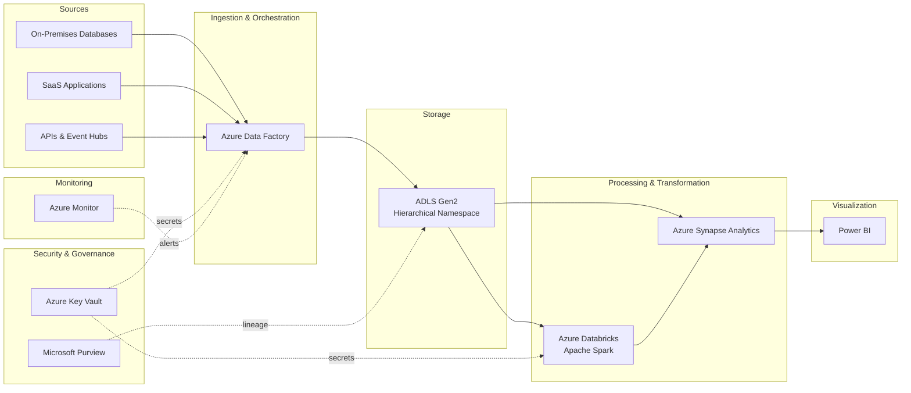

---

### Day 2 — ADLS Gen2: Storage Tiers, Lifecycle Management & File Formats

**Diagram type:** Architecture Diagram

**Caption/Alt-text:**
> This diagram shows the structure of an ADLS Gen2 storage account with Hierarchical Namespace enabled. Data is organized into directories and containers, with lifecycle policies automatically transitioning data across Hot, Cool, and Archive tiers. Supported file formats include CSV, Parquet, and Delta Lake (Parquet with a transaction log).

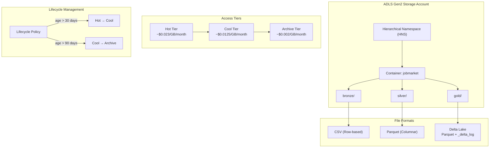

---

### Day 3 — Batch vs Streaming Data Storage, Data Lake Design & Partitioning

**Diagram type:** Flowchart

**Caption/Alt-text:**
> This flowchart shows the data lake directory design process, starting with the batch vs streaming decision. The batch path follows Hive-style partitioning (`source/layer/year=YYYY/month=MM/day=DD/`) and includes compaction logic to address the small file problem. The streaming path routes to event-based storage for continuous ingestion.

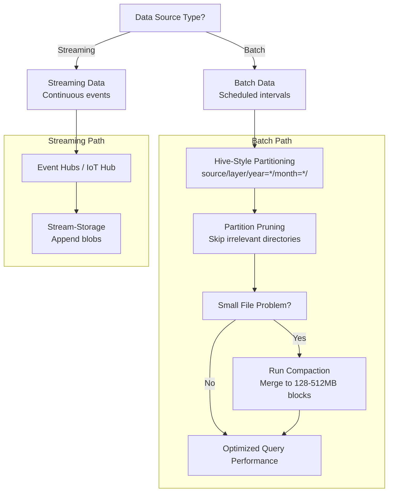

---

### Day 4 — Azure Data Factory: Pipelines, Activities & Debugging

**Diagram type:** Flowchart

**Caption/Alt-text:**
> This flowchart shows the structure of an Azure Data Factory pipeline. A trigger initiates execution, the pipeline runs activities in dependency order with linked services and datasets defining connections and data references. Integration Runtimes handle connectivity, and each run is logged to the Monitor hub for debugging and validation.

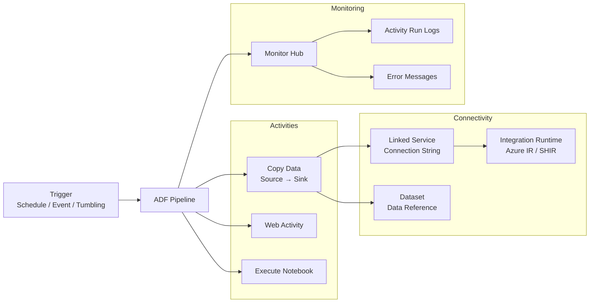

---

### Day 5 — ADF Triggers, Variables & Integration Runtimes

**Diagram type:** Flowchart

**Caption/Alt-text:**
> This flowchart illustrates how ADF triggers initiate pipeline execution. Schedule triggers run on clock intervals, Tumbling Window triggers maintain non-overlapping historical windows with built-in retry, and Event triggers react to storage blob creation. Parameters and variables are passed dynamically into pipeline activities.

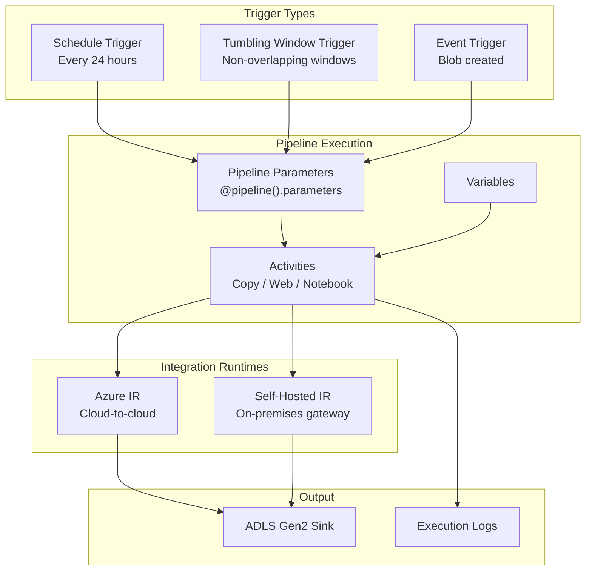

---

### Day 6 — Pipeline Monitoring, Troubleshooting & Batch Ingestion Patterns

**Diagram type:** Concept Map

**Caption/Alt-text:**
> This concept map shows the three key areas of Day 6 learning: monitoring via ADF Monitor hub and alert rules, troubleshooting through activity log analysis, and batch ingestion patterns including full load, incremental load with watermark tables, and upsert using Delta Lake merge operations.

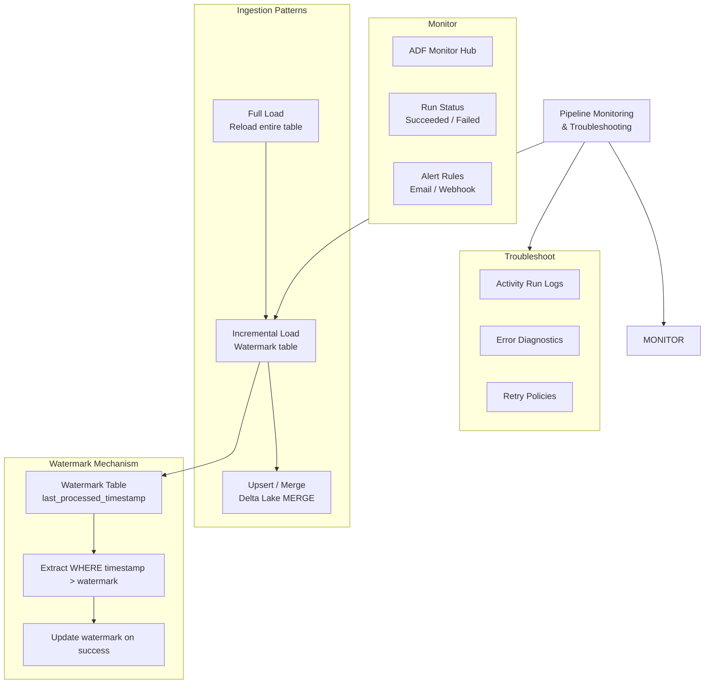

---

### Day 7 — Azure Databricks Environments & Cluster Configuration

**Diagram type:** Architecture Diagram

**Caption/Alt-text:**
> This architecture diagram shows the Azure Databricks workspace structure. Users create Interactive clusters for ad-hoc development (with auto-termination and Spot VMs for cost control) and Job clusters for production execution. Clusters mount ADLS Gen2 via service principal credentials, and notebooks run PySpark code against the mounted data.

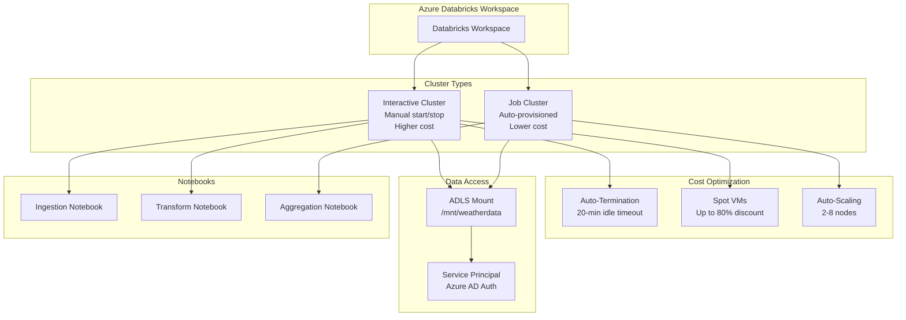

---

### Day 8 — PySpark Data Transformation with Delta Lake

**Diagram type:** Flowchart

**Caption/Alt-text:**
> This flowchart shows the PySpark data transformation pipeline using Delta Lake. Raw CSV data is read from Bronze, cleaned and transformed through DataFrame operations (filter, dropNulls, withColumn), then written to a Silver Delta table. The Delta transaction log enables time travel. Maintenance operations include OPTIMIZE for compaction, ZORDER BY for data co-location, and VACUUM for old version cleanup.

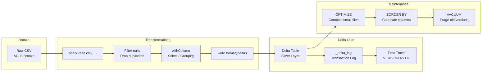

---

### Day 9 — Data Virtualization vs Physical Ingestion, Job Clusters & Cost Optimization

**Diagram type:** Comparison Diagram (Flowchart)

**Caption/Alt-text:**
> This comparison flowchart shows the two data access strategies. The virtualization path queries external sources directly without copying data — faster to develop but slower at query time. The physical ingestion path copies data into local Delta tables — slower to set up but faster for repeated queries. A cost comparison table shows the trade-offs in storage, compute, and query performance.

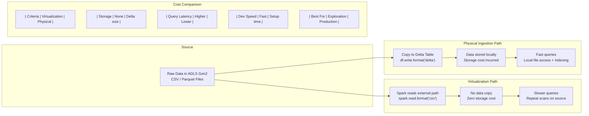

---

### Day 10 — Synapse Analytics: Serverless SQL & Data Virtualization

**Diagram type:** Architecture Diagram

**Caption/Alt-text:**
> This architecture diagram shows how Synapse Serverless SQL pool executes T-SQL queries directly against files in ADLS Gen2 without provisioned infrastructure. Users connect via Synapse Studio or SSMS, write OPENROWSET queries against Parquet or Delta files, and pay only for data scanned (~$5.00/TB). CETAS materializes query results into persistent Parquet files in the Gold layer.

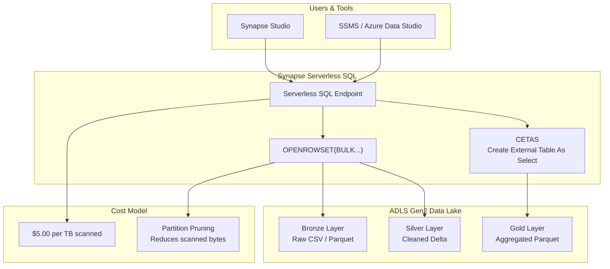

---

### Day 11 — Data Warehousing Design (Star Schema) & Dedicated SQL Pools

**Diagram type:** Concept Map

**Caption/Alt-text:**
> This concept map shows the structure of a star schema within a Synapse Dedicated SQL pool. A central fact table (e.g., temperature readings) is surrounded by dimension tables (date, location, station). Distribution strategies — Hash (fact table), Replicate (small dimensions), and Round-Robin (staging) — are applied to optimize query performance in the MPP architecture.

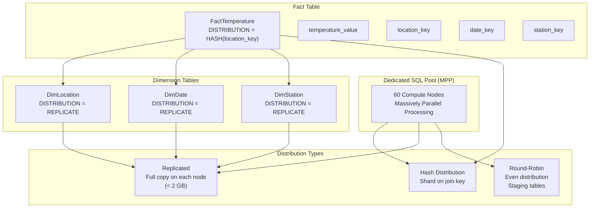

---

### Day 12 — Microsoft Fabric: OneLake, Notebooks & Warehouse

**Diagram type:** Architecture Diagram

**Caption/Alt-text:**
> This diagram shows Microsoft Fabric's unified SaaS architecture centered on OneLake, a multi-cloud data lake. Lakehouses, Warehouses, Notebooks, Pipelines, and Real-Time Analytics all read and write the same Delta Parquet data from OneLake. Power BI connects via Direct Lake mode — querying OneLake data directly without importing or caching.

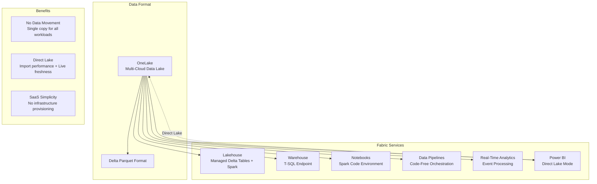

---

### Day 13 — Security: Key Vault, RBAC, ACLs & Private Endpoints

**Diagram type:** Concept Map

**Caption/Alt-text:**
> This concept map shows the four security layers in an Azure data pipeline. Key Vault stores secrets accessed via Managed Identities at runtime. RBAC controls broad resource management access (control plane). Data Lake ACLs provide granular file-level permissions (data plane). Managed Private Endpoints isolate traffic within Azure Virtual Networks, bypassing the public internet.

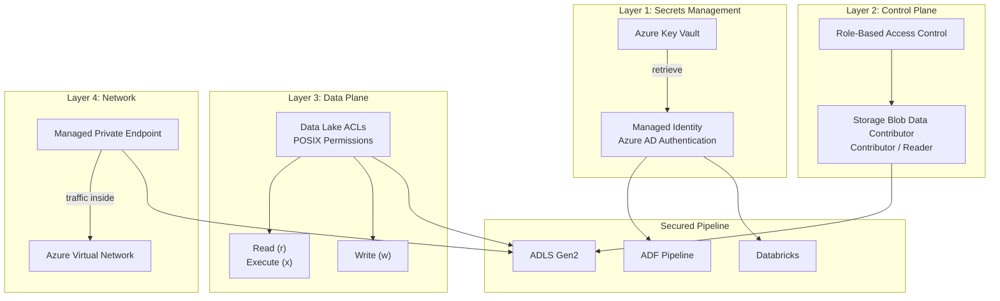

---

### Day 14 — Governance & FinOps: Purview, Cost Management & Budget Alerts

**Diagram type:** Flowchart

**Caption/Alt-text:**
> This flowchart shows the FinOps lifecycle for Azure data pipelines. Resources are tagged with metadata (environment, project, owner) at provisioning time. Cost Management evaluates tagged resources against budget thresholds (50%, 90%, 100%), triggering alerts or automated actions. Purview scans data sources for classification and lineage, creating a searchable data catalog.

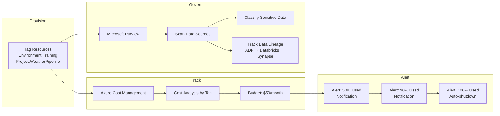

---

*Version: v1.0 | Created: 2026-07-06 | Author: Technical Curriculum Designer*

Visual complete. Copy the Mermaid code blocks into the relevant modules in the learning path document. Trigger Skill 4 again for any remaining flagged modules, or proceed to Skill 5: Quiz Generator when all visuals are done.
