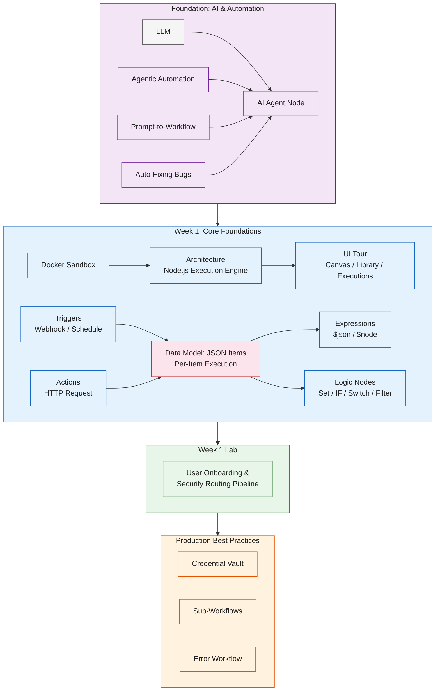

#review: DRAFT

# N8n for Developers — Foundation & Week 1
### 01 — N8n Training Week 1 — Research Synthesis

---

## Concept Map & Research Synthesis

### Prerequisites (Not Taught in This Training)

The sources target junior developers who already code. The following are expected knowledge for learners entering this training and are treated as prerequisites, not curriculum:

| Topic | Reason |
|-------|--------|
| JavaScript fundamentals (objects, arrays, string methods) | Required for expressions, the Code node, and inline transformations |
| JSON data structures | The item data model is a JSON array of objects |
| REST API concepts (methods, request/response payloads) | HTTP Request nodes, webhooks, and mock API labs depend on this |
| HTTP & webhook basics | Webhook triggers send and receive payloads over HTTP |
| Command line & Docker fundamentals | The sandboxed environment is stood up via Docker Compose |

### Structured Outline

```
N8N FOR DEVELOPERS — FOUNDATION & WEEK 1
├── Foundation: AI & Automation Concepts
│   ├── LLM (the AI brain plugged into the system for thinking and understanding)
│   ├── Agentic Automation (AI chooses actions based on context, not hard-coded rules)
│   ├── Prompt-to-Workflow (plain English description maps to canvas nodes)
│   ├── AI Agent Node (goal, memory, and app access in one workspace block)
│   └── Auto-Fixing Bugs (crash feeds logs to an AI node, which fixes and re-runs)
│
├── L&D Design Considerations (how the training is run)
│   ├── Counter low-code skepticism by demonstrating speed and visual debugging
│   ├── Teach the mental model shift: per-item execution, not loops
│   ├── Train in a sandboxed, self-hosted Docker environment
│   ├── 20% theory / 80% hands-on — every lesson followed by a working workflow
│   └── Version control visual workflows early (JSON exports / source control)
│
├── Week 1: The Paradigm Shift (Core Foundations)
│   ├── Day 1: Welcome to n8n — Node.js architecture, Docker setup, UI tour
│   ├── Day 2: Triggers and Actions — Webhook → HTTP Request, JSON "Items"
│   ├── Day 3: Expressions and Dynamic Data — $json, $node, inline JS
│   ├── Day 4: Core Logic Nodes — Edit Fields (Set), IF, Switch, Filter
│   └── Day 5: Week 1 Lab — User Onboarding & Security Routing Pipeline
│
└── Production Best Practices (foundation context)
    ├── Credential Vault (encrypted secrets, never hardcoded)
    ├── Sub-Workflows (Execute Workflow node as reusable functions)
    └── Error Workflow (Error Trigger as a global catch-all)
```

### Visual Concept Map



---

## Key Insights

1. **n8n is a visual orchestration layer, not a code replacement** — built on Node.js, it removes boilerplate (HTTP listeners, payload parsing, loops) while leaving developers' existing API, JSON, and JavaScript skills intact.

2. **Item-based execution is the single most critical mental model** — nodes execute once per item in a JSON array instead of requiring `for` or `.map()` loops; this paradigm shift is the first "aha!" moment learners must reach.

3. **Mapping familiar constructs accelerates adoption and counters low-code skepticism** — `if/else` → IF node, `switch` → Switch node, `.filter()` → Filter node, variable assignment → Edit Fields (Set) node.

4. **The training must be 20% theory / 80% hands-on** — every conceptual lesson is followed by a functioning workflow built on a self-hosted n8n instance in a sandboxed Docker environment where triggers and loops can be broken safely.

5. **Version control should be introduced early** — exporting workflows as JSON or using n8n's source control features makes visual workflows feel like professional code and reassures developers.

6. **Production discipline starts in Week 1** — secrets belong in the encrypted Credential Vault, reusable logic belongs in sub-workflows, and failures belong in a dedicated Error Workflow with the Error Trigger node.

7. **Expressions are just JavaScript** — the `{{ }}` expression editor accepts standard JS syntax and methods, letting developers transform data inline with familiar string and math functions.

8. **The Webhook node replaces an Express handler** — n8n handles the server listener, payload parsing, and HTTP response that developers would otherwise write as `app.post('/webhook', (req, res) => {...})`.

---

## Suggested Topic List

**Scope:** Foundation + Week 1 (The Paradigm Shift). Weeks 2-4 (Developer Power Tools, Enterprise Architecture & Resilience, Capstone) are deferred to later phases of the larger n8n training.

**Training environment:** The training runs on a **self-hosted n8n instance** set up by each learner in a sandboxed Docker environment (Docker Compose). Deferred to later phases: Workflow Version Control (JSON exports / source control) and Credential Vault & secrets handling.

**Prerequisites to confirm before Day 1:** JavaScript basics, JSON data structures, REST API concepts, HTTP & webhook basics, command line and Docker fundamentals.

| Day | Topic | Phase | Tag |
|-----|-------|-------|-----|
| 0 | Foundation: LLMs & Agentic Automation | Foundation | — |
| 0 | Foundation: Prompt-to-Workflow, AI Agent Node, Auto-Fixing Bugs | Foundation | — |
| 1 | n8n Architecture: Node.js backend, execution engine, paradigm shift | Core Foundations | — |
| 1 | Sandbox Setup via Docker (self-hosted n8n) & UI Tour (Canvas, node library, execution history) | Core Foundations | — |
| 2 | Triggers vs Actions: Webhook and Schedule nodes | Core Foundations | — |
| 2 | The Data Model: JSON Items & per-item execution | Core Foundations | — |
| 2 | First Workflow: Webhook → HTTP Request | Core Foundations | — |
| 3 | Expression Editor: $json and $node context resolution | Core Foundations | — |
| 3 | Inline Data Transformation with JavaScript expressions | Core Foundations | — |
| 4 | Edit Fields (Set) node: replacing variable assignment | Core Foundations | — |
| 4 | IF, Switch, Filter nodes: replacing if/else, switch, and filter | Core Foundations | — |
| 5 | Week 1 Lab: User Onboarding & Security Routing Pipeline | Hands-On Lab | — |

[GAP] — none for this phase. Workflow Version Control and Credential Vault were flagged in Skill 1 and deferred by the owner to a later phase.

---

*Version: v1.0 | Created: 2026-08-13 | Author: Technical Curriculum Designer*

Synthesis complete. Please review the concept map, key insights, and suggested topic list. Confirm, adjust, or add topics before proceeding to Skill 2: Learning Path Architect.
