#review: DRAFT

# N8n for Developers — Foundation & Week 1
### 02 — N8n Training Week 1 — Learning Path Architect

---

## Learning Path Skeleton

### Metadata

| Field | Value |
|-------|-------|
| Learning Path Title | N8n for Developers — Foundation & Week 1 (The Paradigm Shift) |
| Training POC | Data Engineering Manager |
| Version | v1.0 |
| Date Created | 2026-08-13 |
| Created By | Jem Villanueva |
| Objective | Learners will be able to set up a self-hosted n8n instance in a Docker sandbox and build webhook-driven workflows that transform, route, and deliver JSON data using expressions and core logic nodes — without writing loops |
| Target Audience | Junior developers with API, JSON, and JavaScript experience who are skeptical of low-code tools |
| Knowledge Prerequisites | JavaScript fundamentals, JSON data structures, REST API concepts, HTTP & webhook basics, command line & Docker fundamentals |
| Tools Needed | Self-hosted n8n (Docker Compose), Docker Desktop, cURL or Postman, JSONPlaceholder mock API |
| Total Duration | 6 days (24 hours) |

### Training Timeline

```mermaid
gantt
    title N8n for Developers — Foundation & Week 1 Schedule
    dateFormat D
    axisFormat Day %e
    tickInterval 1day
    weekday monday

    section Foundation
    Day 0 - AI & Automation Concepts    :f0, 0, 1d

    section Core Foundations
    Days 1-4 - Core Foundations         :f1, 1, 4d

    section Hands-On Lab
    Day 5 - Week 1 Lab                  :f2, 5, 1d
```

### Day-by-Day Breakdown

| Day | Topic | Domain | Delivery Method | Est. Time | Hands-On | Visual |
|-----|-------|--------|-----------------|-----------|----------|--------|
| 0 | Foundation: AI & Automation Concepts (LLM, agentic automation, prompt-to-workflow, AI Agent node, auto-fixing bugs) | Automation | Lecture + Discussion | 4h | [THEORY ONLY] | [VISUAL RECOMMENDED] |
| 1 | n8n Architecture, Self-Hosted Docker Setup & UI Tour | Automation | Lecture + Demo | 4h | [HANDS-ON RECOMMENDED] | [VISUAL RECOMMENDED] |
| 2 | Triggers, Actions & the Items Data Model | Automation | Lecture + Workshop | 4h | [HANDS-ON RECOMMENDED] | [VISUAL RECOMMENDED] |
| 3 | Expressions & Dynamic Data | Automation | Lecture + Workshop | 4h | [HANDS-ON RECOMMENDED] | [VISUAL RECOMMENDED] |
| 4 | Core Logic Nodes (Set, IF, Switch, Filter) | Automation | Lecture + Workshop | 4h | [HANDS-ON RECOMMENDED] | [VISUAL RECOMMENDED] |
| 5 | Week 1 Lab: User Onboarding & Security Routing Pipeline | Automation | Lab / Project | 4h | [HANDS-ON RECOMMENDED] | [NO VISUAL NEEDED] |

### Day Details

#### Day 0 — Foundation: AI & Automation Concepts
- **Objective:** Explain how LLMs, agentic automation, and prompt-to-workflow map to n8n's AI Agent node and auto-fixing bug loops.
- **Concepts:**
  - LLM as the core AI brain (OpenAI, Claude) that plugs into automation for thinking and understanding
  - Agentic automation: AI that chooses actions from context instead of hard-coded rules
  - Prompt-to-workflow: building automations from plain English descriptions
  - AI Agent node: goal, memory, and app access in a single workspace block
  - Auto-fixing bugs: crash → error logs → AI diagnoses → fixes settings → re-runs
  - Overview of where these capabilities live in n8n
- **Estimated Time:** 4h
- **Hands-On:** [THEORY ONLY]
- **Visual:** [VISUAL RECOMMENDED]

#### Day 1 — n8n Architecture, Self-Hosted Docker Setup & UI Tour
- **Objective:** Stand up a self-hosted n8n instance in a sandboxed Docker environment and navigate the canvas, node library, and execution history.
- **Concepts:**
  - Node.js backend and the execution engine
  - The paradigm shift: visual orchestration vs Express handlers and boilerplate code
  - Docker Compose sandbox setup for self-hosted n8n
  - UI tour: canvas, left panel (node library), execution history
- **Estimated Time:** 4h
- **Hands-On:** [HANDS-ON RECOMMENDED]
- **Visual:** [VISUAL RECOMMENDED]

#### Day 2 — Triggers, Actions & the Items Data Model
- **Objective:** Build a Webhook → HTTP Request workflow and explain how data flows between nodes as JSON items.
- **Concepts:**
  - Triggers vs actions (Webhook, Schedule, HTTP Request)
  - JSON items data model: an array of objects
  - The per-item execution rule (no loops for basic iteration)
  - First workflow: Webhook → HTTP Request against a mock API
- **Estimated Time:** 4h
- **Hands-On:** [HANDS-ON RECOMMENDED]
- **Visual:** [VISUAL RECOMMENDED]

#### Day 3 — Expressions & Dynamic Data
- **Objective:** Reference data from previous nodes using the expression editor with `$json` and `$node` scope resolution.
- **Concepts:**
  - The expression engine: JavaScript syntax wrapped in `{{ }}`
  - `$json`: current item data access
  - `$node`: reaching back to a specific node's output
  - Inline data transformation with string and math methods
- **Estimated Time:** 4h
- **Hands-On:** [HANDS-ON RECOMMENDED]
- **Visual:** [VISUAL RECOMMENDED]

#### Day 4 — Core Logic Nodes
- **Objective:** Replace procedural JavaScript control flow with Edit Fields (Set), IF, Switch, and Filter nodes.
- **Concepts:**
  - Edit Fields (Set) node: replacing variable assignment
  - IF node: true/false branches evaluated per item
  - Switch node: multi-route branching (up to 4 routes)
  - Filter node: dropping items that fail a condition
- **Estimated Time:** 4h
- **Hands-On:** [HANDS-ON RECOMMENDED]
- **Visual:** [VISUAL RECOMMENDED]

#### Day 5 — Week 1 Lab: User Onboarding & Security Routing Pipeline
- **Objective:** Build an end-to-end webhook workflow that normalizes signup data, checks email domains, and routes corporate and public users to different mock endpoints.
- **Concepts:**
  - Item Lists node: split out a nested JSON array into separate items
  - Data normalization with Edit Fields and expressions (`trim().toLowerCase()`)
  - Switch node routing by email domain
  - HTTP Request nodes to mock CRM and analytics endpoints
  - Verifying routing through the execution history panel
- **Estimated Time:** 4h
- **Hands-On:** [HANDS-ON RECOMMENDED]
- **Visual:** [NO VISUAL NEEDED]

---

*Version: v1.0 | Created: 2026-08-13 | Author: Jem Villanueva*

Learning path skeleton complete. Please review the structure, day breakdown, and visual flags. Confirm, adjust, or add changes before proceeding to Skill 3: Module Content Builder.
