#review: APPROVED
---
tags:
  topic-slug: n8n-training-week-1
  skill-domains: [automation, integration, software-development]
  audience: junior-developers
  difficulty: beginner
  delivery-methods: [lecture, demo, workshop, hands-on-lab]
  total-days: 6
  status: approved
---

# N8n for Developers — Foundation & Week 1
### 03 — N8n Training Week 1 — Module Content

---

## Metadata

| Field | Value |
|-------|-------|
| **Title** | N8n for Developers — Foundation & Week 1 (The Paradigm Shift) |
| **Version** | v1.0 |
| **Date Created** | 2026-08-13 |
| **Author** | Jem Villanueva |
| **Target Audience** | Junior developers with API, JSON, and JavaScript experience |
| **Knowledge Prerequisites** | JavaScript fundamentals, JSON data structures, REST API concepts, HTTP & webhook basics, command line & Docker fundamentals |
| **Tools Needed** | Self-hosted n8n (Docker Compose), Docker Desktop, cURL or Postman, JSONPlaceholder mock API |
| **Skill Domains** | Automation, Integration, Software Development |
| **Dataset Reference** | [JSONPlaceholder](https://jsonplaceholder.typicode.com/) — public mock API used across the hands-on exercises |
| **Total Duration** | 6 days / 24 hours |
| **Suggested Pace** | 4 hours per day — 20% theory / 80% hands-on |

---

## Training Timeline

```mermaid
gantt
    title N8n for Developers — Foundation & Week 1 Schedule
    dateFormat D
    axisFormat Day %e
    tickInterval 1day
    weekday monday

    section Foundation
    Day 0 - AI & Automation Concepts    :f0, 0, 1d

    section Core Foundations
    Days 1-4 - Core Foundations         :f1, 1, 4d

    section Hands-On Lab
    Day 5 - Week 1 Lab                  :f2, 5, 1d
```



---

## Module Content

---

#### Day 0: Foundation — AI & Automation Concepts

- **Learning Objective:** Explain how LLMs, agentic automation, and prompt-to-workflow map to n8n's AI Agent node and auto-fixing bug loops.
- **Core Idea:** An LLM (large language model — an AI system trained on massive text data that generates and understands natural language) acts as the core AI brain plugged into an automation platform to handle thinking, processing, and understanding. Agentic automation is the shift from hard-coded rules to AI that reads context and makes its own choices when handling messy data. A prompt-to-workflow is the pattern where a plain-English description is automatically mapped to connected nodes on the canvas.
- **Why It Matters:** Junior developers will see AI-assisted building inside n8n as the platform expands beyond classic node-based automations. Knowing what an AI Agent node is — a workspace block given a goal, memory, and access to apps that figures out how to solve a task itself — keeps AI features from becoming a black box. It also frames the larger n8n training arc, where later phases use agents and auto-fixing bug loops (a crash triggers a loop, error logs go to an AI node, which diagnoses, fixes, and re-runs).
- **How It Works:** n8n exposes AI capabilities as nodes. The AI Agent node connects to an LLM through a credential, receives a goal, and uses connected tools to complete the task. Prompt-to-workflow appears in n8n's AI-assisted builders, where the user types a description and the system arranges the nodes. Auto-fixing runs the loop in reverse: a failure feeds logs to the AI, which adjusts settings and re-executes the workflow.
- **Supplemental Reading:**
  - 📄 [Official Documentation — n8n AI Agent node]: https://docs.n8n.io/integrations/builtin/cluster-nodes/root-nodes/n8n-nodes-langchain.agent
  - 📝 [Blog — n8n: Introduction to AI agents]: https://blog.n8n.io/ai-agents/
  - 📝 [Article — Anthropic: What are AI agents?]: https://www.anthropic.com/research/what-are-ai-agents
  > All links are validated before publishing.
- **Hands-on Activity:** *(Not applicable — theory day.)*
  > This concept map links the five AI concepts covered in Day 0. The LLM acts as the AI brain that powers agentic automation, connects to the AI Agent node, and translates plain-English prompts into workflows. The AI Agent node enables agentic automation and drives the auto-fixing bug loop that diagnoses and re-runs failed workflows.

  ```mermaid
  graph TD
      subgraph "AI & Automation Concepts"
          LLM["LLM (Large Language Model)"]
          AGENTIC["Agentic Automation"]
          PTW["Prompt-to-Workflow"]
          AGENT["AI Agent Node"]
          LOOP["Auto-Fixing Bug Loop"]
      end

      LLM -->|powers| AGENTIC
      LLM -->|connects to| AGENT
      LLM -->|translates text for| PTW
      AGENT -->|enables| AGENTIC
      AGENT -->|drives| LOOP
  ```

---

#### Day 1: n8n Architecture, Self-Hosted Docker Setup & UI Tour

- **Learning Objective:** Stand up a self-hosted n8n instance in a sandboxed Docker environment and navigate the canvas, node library, and execution history.
- **Core Idea:** n8n is a visual orchestration layer built on Node.js that executes JavaScript natively; it removes boilerplate rather than replacing coding skills. When a workflow triggers, the execution engine spins up an execution and data flows sequentially from left to right across nodes. The paradigm shift for developers is that an Express-style handler becomes a Webhook node, which handles the server listener, payload parsing, and HTTP response under the hood.
- **Why It Matters:** Developers new to n8n often resist low-code tools, so the value proposition — speed of delivery and visual debugging — must be demonstrated immediately. A sandboxed, self-hosted Docker environment gives learners a safe space to break triggers, loops, and workflows without affecting production. Self-hosting also mirrors how the team will eventually run n8n internally.
- **How It Works:** Each learner creates a Docker Compose project using the n8n image (`n8nio/n8n`), maps port 5678, and defines a named volume for `/home/node/.n8n`. Running `docker compose up -d` and opening `http://localhost:5678` completes the initial owner-account setup. The UI then offers three key surfaces: the canvas (the visual IDE), the left panel (the node library, comparable to pre-packaged npm modules), and the execution history (the debugger that records every payload entering and exiting every node).
- **Supplemental Reading:**
  - 📄 [Official Documentation — n8n: Install with Docker]: https://docs.n8n.io/deploy/host-n8n/install-options/install-with-docker
  - 📝 [Official Documentation — Docker Compose]: https://docs.docker.com/compose/
  - 📝 [Blog — n8n blog (self-hosting guides and tutorials)]: https://blog.n8n.io/
  > All links are validated before publishing.
- **Hands-on Activity:** Self-Hosted Project Scaffold — learners create the recommended project structure for self-hosted n8n from the official documentation (docker-compose.yml, environment settings, and a named data volume), launch the instance, complete the admin setup, and tour the canvas, node library, and execution history.
  > This architecture diagram shows the self-hosted n8n execution model inside a Docker sandbox. The execution engine starts each run, and data flows left to right from the trigger through connected nodes. Around the instance sit the three UI surfaces — the canvas, the node library, and the execution history — which support building, extending, and debugging workflows.

  ```mermaid
  graph LR
      subgraph "Docker Sandbox (Self-Hosted)"
          subgraph "n8n Instance"
              ENGINE["Execution Engine"]
              TRIGGER["Trigger"]
              N1["Node 1"]
              N2["Node 2"]
              ENGINE -->|starts execution| TRIGGER
              TRIGGER -->|data flows left to right| N1
              N1 -->|data flows left to right| N2
          end

          subgraph "n8n UI Surfaces"
              CANVAS["Canvas (Visual IDE)"]
              LIBRARY["Node Library"]
              HISTORY["Execution History"]
          end

          CANVAS -->|builds workflows in| ENGINE
          LIBRARY -->|provides pre-built nodes to| CANVAS
          HISTORY -->|records payloads from| ENGINE
      end
  ```

---

#### Day 2: Triggers, Actions & the Items Data Model

- **Learning Objective:** Build a Webhook → HTTP Request workflow and explain how data flows between nodes as JSON items.
- **Core Idea:** Workflows divide into triggers, which passively listen for events (for example the Webhook or Schedule nodes), and actions, which actively do the work (for example HTTP Request or database queries). n8n passes data between nodes as an array of objects called items, each wrapped in a `json` property. The most critical rule is per-item execution: if a node receives an array of two items, it executes its logic twice — once per item — removing the need to write `for` or `.map()` loops for basic iteration.
- **Why It Matters:** Per-item execution is the single most important "aha!" moment for developers coming from imperative code. Misunderstanding it leads to over-engineering, such as writing loops inside nodes that n8n already iterates over automatically. It also explains why one payload can fan out into many separate actions downstream.
- **How It Works:** Learners add a Webhook trigger (POST, path `test-hook`), connect an HTTP Request action, and configure it to GET `https://jsonplaceholder.typicode.com/users/1`. Clicking "Listen for Test Event" exposes a test URL; sending a POST via cURL or Postman fires the workflow, and the execution view shows the incoming JSON payload arriving as items that flow into the HTTP Request node.
- **Supplemental Reading:**
  - 📄 [Official Documentation — n8n: Understand n8n's data structure]: https://docs.n8n.io/build/work-with-data/understand-n8ns-data-structure
  - 📄 [Official Documentation — n8n: Webhook node]: https://docs.n8n.io/integrations/builtin/core-nodes/n8n-nodes-base.webhook
  - 📝 [Resource — JSONPlaceholder mock API]: https://jsonplaceholder.typicode.com/
  > All links are validated before publishing.
- **Hands-on Activity:** First Webhook Workflow — learners build a Webhook → HTTP Request workflow against the JSONPlaceholder mock API and inspect the JSON items produced at each step in the execution view.
  > This flowchart traces the Webhook → HTTP Request workflow built in Day 2. A POST from cURL or Postman fires the webhook trigger, and the incoming JSON payload arrives as items. Each item triggers one execution of the HTTP Request node, which calls the JSONPlaceholder API and returns the response as items for the next step.

  ```mermaid
  graph TD
      CLIENT["cURL or Postman"]
      WEBHOOK["Webhook Trigger (POST /test-hook)"]
      ITEMS["JSON Payload Arrives as Items"]
      HTTP["HTTP Request Node (GET /users/1)"]
      API["JSONPlaceholder API"]
      RESP["Response Items"]

      CLIENT -->|sends POST| WEBHOOK
      WEBHOOK -->|converts payload to| ITEMS
      ITEMS -->|runs once per item| HTTP
      HTTP -->|sends GET request| API
      API -->|returns JSON| HTTP
      HTTP -->|outputs| RESP
  ```

---

#### Day 3: Expressions & Dynamic Data

- **Learning Objective:** Reference data from previous nodes using the expression editor with `$json` and `$node` scope resolution.
- **Core Idea:** Hardcoded values are bad practice in workflows just as in code; n8n provides an expression editor where standard JavaScript syntax is wrapped in double curly braces `{{ }}` and evaluated per item. The `$json` variable accesses the current item's data (`{{ $json.email }}`), while `$node` reaches back to a specific node's output (`{{ $node["Webhook"].json.body.user_id }}`). Because expressions are JavaScript, learners can transform data inline with familiar string and math methods.
- **Why It Matters:** Dynamic data makes workflows reusable instead of one-off scripts. Pulling values from previous nodes lets a single workflow handle any payload, and the expression editor shows live results during configuration — immediate feedback developers value. It is also the foundation for everything that follows, since logic nodes and HTTP actions are only useful when they reference real data.
- **How It Works:** The expression engine resolves `{{ $json }}` against the item currently being processed by the node, and `{{ $node["NodeName"].json.field }}` against the saved output of the named node. Inline transformation is standard JavaScript, for example `{{ $json.first_name.trim().toUpperCase() }}` or `{{ Math.floor(Math.random() * 100) }}`. Learners practice by feeding a webhook payload and deriving new fields without writing a single script.
- **Supplemental Reading:**
  - 📄 [Official Documentation — n8n: Expressions for data transformation]: https://docs.n8n.io/build/work-with-data/transform-data/expressions-for-data-transformation
  - 📄 [Official Documentation — n8n: Reference data from previous nodes]: https://docs.n8n.io/build/work-with-data/reference-data/reference-previous-nodes
  - 📝 [Article — Expressions in n8n (dev.to)]: https://dev.to/kasir-barati/expressions-in-n8n-537
  > All links are validated before publishing.
- **Hands-on Activity:** Expression Drill — learners send a webhook payload through an Edit Fields node, building `$json` and `$node` expressions that trim, lowercase, and combine fields, and verify live results in the expression editor.
  > This concept map shows how n8n resolves expressions in the expression editor. The $json scope reads data from the item currently being processed, while the $node scope reads the saved output of a named node. Both scopes let workflows reference live data instead of hardcoded values.

  ```mermaid
  graph TD
      EXPR["Expression Editor (wraps JavaScript)"]
      JSON["$json (Current Item's Data)"]
      NODE["$node (Named Node's Output)"]
      ITEM["Item Currently Processed"]
      PREV["Output of a Named Node"]

      EXPR -->|resolves against| JSON
      EXPR -->|resolves against| NODE
      JSON -->|reads data from| ITEM
      NODE -->|reads data from| PREV
  ```

---

#### Day 4: Core Logic Nodes

- **Learning Objective:** Replace procedural JavaScript control flow with Edit Fields (Set), IF, Switch, and Filter nodes.
- **Core Idea:** Visual programming maps procedural code statements to functional nodes. The Edit Fields (Set) node replaces variable assignment — a JavaScript statement like `const fullName = firstName + " " + lastName;` becomes a new field populated by the expression `{{ $json.firstName }} {{ $json.lastName }}`. The IF node evaluates a condition and routes each item down a `true` or `false` output; the Switch node creates multiple output routes; and the Filter node discards items that fail a condition.
- **Why It Matters:** These four nodes cover most branching and cleanup logic in real workflows and let developers translate code they already know into canvas logic quickly. Understanding per-item evaluation matters here: IF and Switch evaluate independently for every item, so several items can split across branches simultaneously.
- **How It Works:** The IF node evaluates its condition per item and sends matching items down the true path and the rest down the false path. The Switch node supports up to four output routes for distinct conditions (for example `status === 'pending'`, `'active'`, or `'deleted'`). The Filter node drops items entirely, like `.filter()` — only items that pass continue downstream.
- **Supplemental Reading:**
  - 📄 [Official Documentation — n8n: IF node]: https://docs.n8n.io/integrations/builtin/core-nodes/n8n-nodes-base.if
  - 📄 [Official Documentation — n8n: Switch node]: https://docs.n8n.io/integrations/builtin/core-nodes/n8n-nodes-base.switch
  - 📄 [Official Documentation — n8n: Filter node]: https://docs.n8n.io/integrations/builtin/core-nodes/n8n-nodes-base.filter
  > All links are validated before publishing.
- **Hands-on Activity:** Routing Mini-Lab — learners feed a multi-item JSON array through Edit Fields, IF, Switch, and Filter nodes and observe items splitting across the true/false and route outputs per item.
  > This comparison diagram maps familiar JavaScript constructs to their n8n node equivalents. Variable assignment maps to the Edit Fields (Set) node, if/else branching maps to the IF node, switch statements map to the Switch node, and array.filter() cleanup maps to the Filter node.

  ```mermaid
  graph TD
      subgraph "JavaScript Constructs"
          ASSIGN["Variable Assignment"]
          IFELSE["if / else Branching"]
          SWITCH["switch / Multiple Cases"]
          FILTER["array.filter() Cleanup"]
      end

      subgraph "n8n Node Equivalents"
          SET["Edit Fields (Set)"]
          IF["IF"]
          SW["Switch"]
          FL["Filter"]
      end

      ASSIGN -->|maps to| SET
      IFELSE -->|maps to| IF
      SWITCH -->|maps to| SW
      FILTER -->|maps to| FL
  ```

---

#### Day 5: Week 1 Lab — User Onboarding & Security Routing Pipeline

- **Learning Objective:** Build an end-to-end webhook workflow that normalizes signup data, checks email domains, and routes corporate and public users to different mock endpoints.
- **Core Idea:** This is the Week 1 lab, a cumulative exercise: a webhook receives new user signups, the data is normalized, the email domain is checked, and users are routed to different mock endpoints based on that check. The workflow reuses every concept from Days 1-4 — triggers, items, expressions, logic nodes, and HTTP actions.
- **Why It Matters:** The lab proves the paradigm shift in practice by mirroring a real integration scenario — user onboarding and security routing — end to end. It also demonstrates the per-item rule at scale: a single payload containing multiple users fans out into separate items that travel different branches of the same workflow.
- **How It Works:** The webhook receives a JSON body containing a `users` array. An Item Lists node (Split Out Items operation) converts the single object into separate n8n items. An Edit Fields node creates `clean_email` using `{{ $json.email.trim().toLowerCase() }}`. A Switch node routes `@corporate.com` emails to a mock CRM endpoint and other domains to a mock analytics endpoint, both hosted on JSONPlaceholder. Learners verify the result by watching Alice's data travel down Route 0 and Bob's data travel down Route 1 in the execution history panel.
- **Supplemental Reading:**
  - 📄 [Official Documentation — n8n: Understand n8n's data structure]: https://docs.n8n.io/build/work-with-data/understand-n8ns-data-structure
  - 📄 [Official Documentation — n8n: Edit Fields (Set) node]: https://docs.n8n.io/integrations/builtin/core-nodes/n8n-nodes-base.set
  - 📝 [Resource — JSONPlaceholder mock API]: https://jsonplaceholder.typicode.com/
  > All links are validated before publishing.
- **Hands-on Activity:** User Onboarding & Security Routing Pipeline — learners build the full Week 1 lab: webhook trigger, item split, email normalization, domain-based Switch routing, and POST actions to two mock endpoints, verified in the execution history.

---

## Related Documents

| Document | Location |
|---|---|
| **Published HTML** | `outputs/n8n-training-week-1/07-n8n-training-week-1-html.html` — generated by Skill 7 |
| **Capstone Project Brief** | `outputs/n8n-training-week-1/08-n8n-training-week-1-capstone.md` — generated by Skill 8 |
| **Hands-On Activities** | `outputs/n8n-training-week-1/09-n8n-training-week-1-hands-on-activities.md` — generated by Skill 9 |

---

*Version: v1.0 | Created: 2026-08-13 | Author: Jem Villanueva*

All module content is complete. If visuals are needed, trigger Skill 4 for flagged modules.
