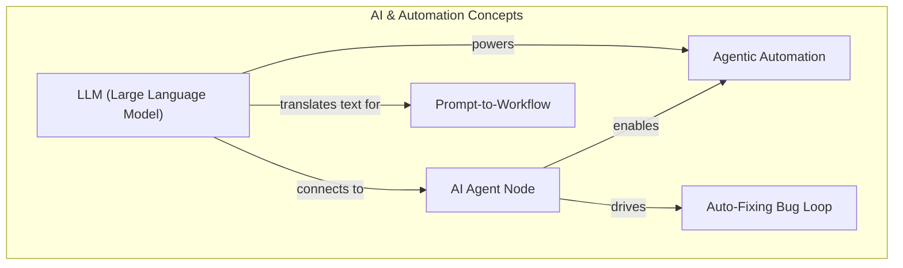
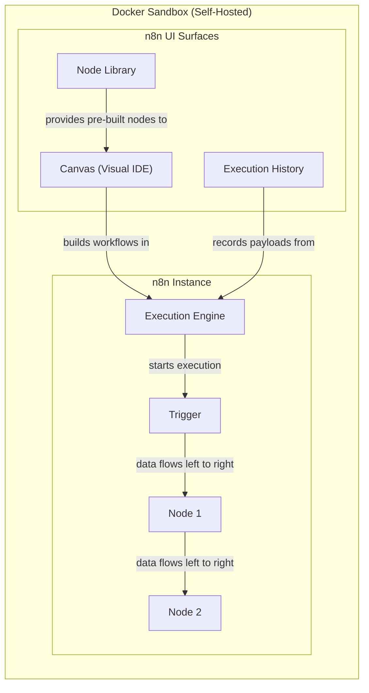
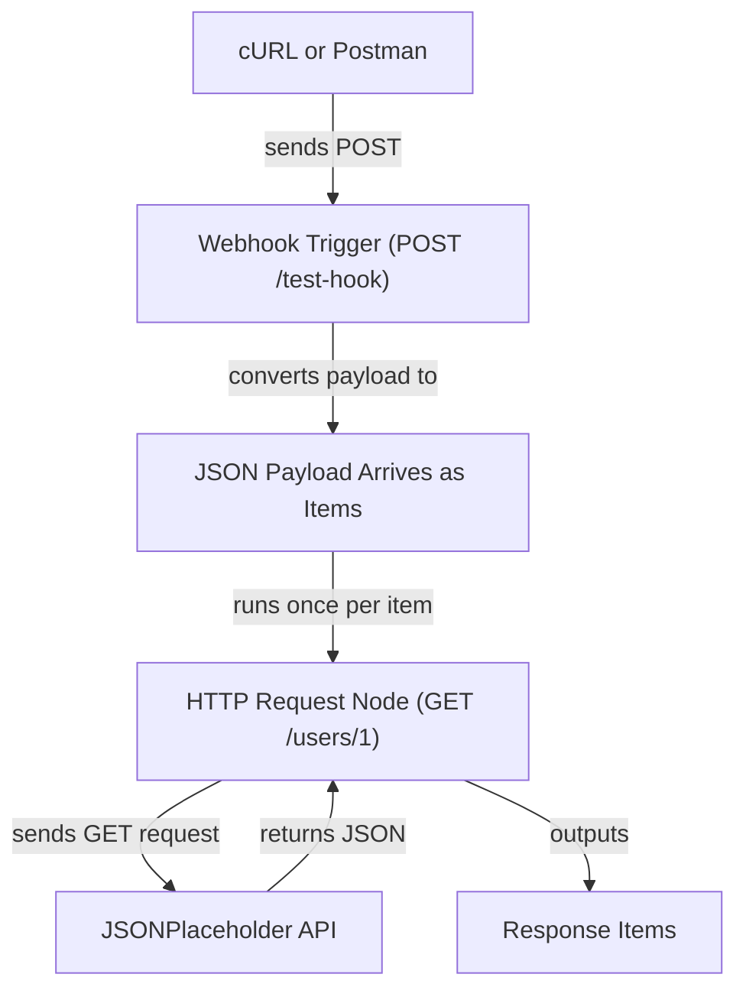
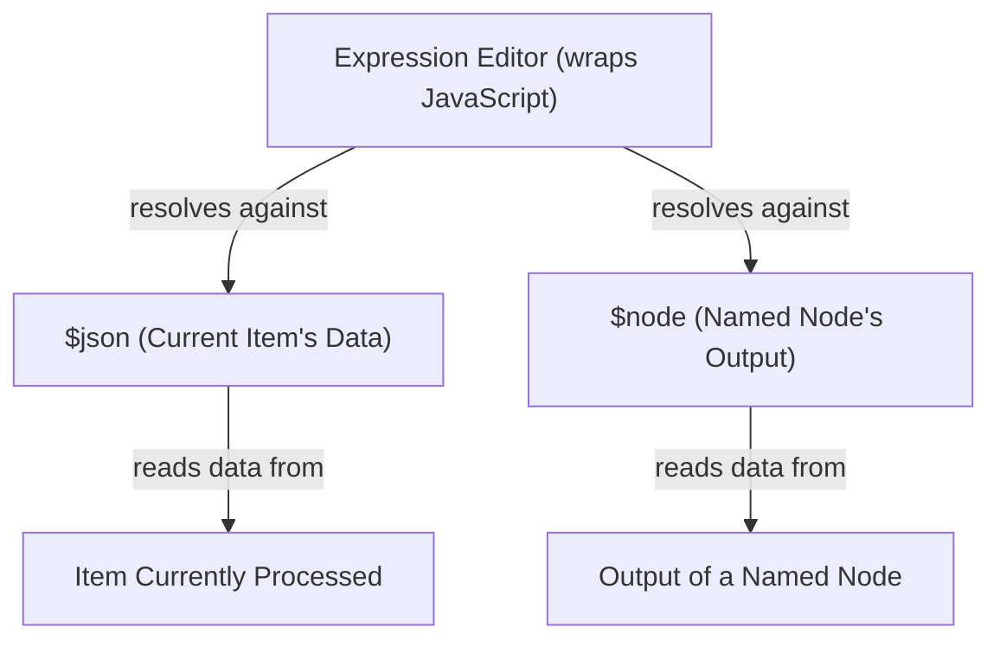
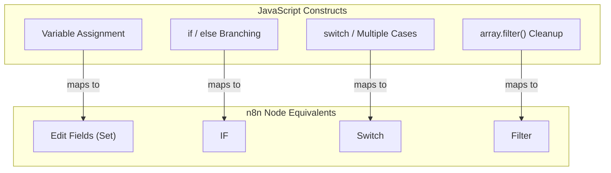

#review: APPROVED

# N8n for Developers — Foundation & Week 1
### 04 — N8n Training Week 1 — Visual Generator

---

## Visuals

---

### Day 0: Foundation — AI & Automation Concepts

**Recommended diagram type:** Concept Map
**Reason:** The visual links LLM, agentic automation, prompt-to-workflow, and the AI Agent node as a set of interrelated ideas rather than a linear process — a concept map best shows how each concept connects to and depends on the others.

**Mermaid Code Block**

**Caption / Alt-text:**
> This concept map links the five AI concepts covered in Day 0. The LLM acts as the AI brain that powers agentic automation, connects to the AI Agent node, and translates plain-English prompts into workflows. The AI Agent node enables agentic automation and drives the auto-fixing bug loop that diagnoses and re-runs failed workflows.

---

### Day 1: n8n Architecture, Self-Hosted Docker Setup & UI Tour

**Recommended diagram type:** Architecture Diagram
**Reason:** The visual must show how the n8n execution engine, the Docker sandbox, and the three UI surfaces connect as a system — an architecture diagram fits component-and-connection mapping.

**Mermaid Code Block**

**Caption / Alt-text:**
> This architecture diagram shows the self-hosted n8n execution model inside a Docker sandbox. The execution engine starts each run, and data flows left to right from the trigger through connected nodes. Around the instance sit the three UI surfaces — the canvas, the node library, and the execution history — which support building, extending, and debugging workflows.

---

### Day 2: Triggers, Actions & the Items Data Model

**Recommended diagram type:** Flowchart
**Reason:** The Webhook → HTTP Request workflow is a step-by-step process, and the per-item execution rule is best shown as items flowing left to right through stages.

**Mermaid Code Block**

**Caption / Alt-text:**
> This flowchart traces the Webhook → HTTP Request workflow built in Day 2. A POST from cURL or Postman fires the webhook trigger, and the incoming JSON payload arrives as items. Each item triggers one execution of the HTTP Request node, which calls the JSONPlaceholder API and returns the response as items for the next step.

---

### Day 3: Expressions & Dynamic Data

**Recommended diagram type:** Concept Map
**Reason:** The visual contrasts two expression scopes ($json and $node) and their relationship to node outputs — a concept map shows those relationships clearly without implying a process order.

**Mermaid Code Block**

**Caption / Alt-text:**
> This concept map shows how n8n resolves expressions in the expression editor. The $json scope reads data from the item currently being processed, while the $node scope reads the saved output of a named node. Both scopes let workflows reference live data instead of hardcoded values.

---

### Day 4: Core Logic Nodes

**Recommended diagram type:** Concept Map
**Reason:** The visual maps JavaScript constructs (assignment, if/else, switch, filter) to their n8n node equivalents — a comparison of equivalences, not a process flow.

**Mermaid Code Block**

**Caption / Alt-text:**
> This comparison diagram maps familiar JavaScript constructs to their n8n node equivalents. Variable assignment maps to the Edit Fields (Set) node, if/else branching maps to the IF node, switch statements map to the Switch node, and array.filter() cleanup maps to the Filter node.

---

## Output Summary

| Day | Topic | Diagram Type | Status |
|-----|-------|-------------|--------|
| Day 0 | AI & Automation Concepts | Concept Map | ✅ Generated |
| Day 1 | n8n Architecture, Docker Setup & UI Tour | Architecture Diagram | ✅ Generated |
| Day 2 | Triggers, Actions & the Items Data Model | Flowchart | ✅ Generated |
| Day 3 | Expressions & Dynamic Data | Concept Map | ✅ Generated |
| Day 4 | Core Logic Nodes | Concept Map | ✅ Generated |
| Day 5 | Week 1 Lab — User Onboarding & Security Routing | — | ❌ None (provided in source material) |

---

*Version: v1.0 | Created: 2026-08-13 | Author: Jem Villanueva*

Visual complete. Copy the Mermaid code blocks into the relevant modules in the learning path document. Trigger Skill 4 again for any remaining flagged modules, or proceed to Skill 5: Quiz Generator when all visuals are done.
