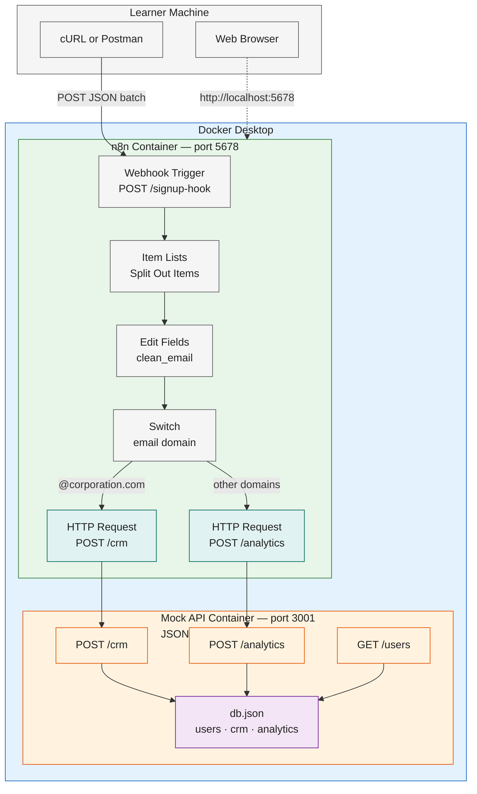

#review: DRAFT

# N8n for Developers — Foundation & Week 1
### 09 — N8n Training Week 1 — Hands-On Activities

---

## Metadata

| Field | Value |
|-------|-------|
| **Title** | N8n for Developers — Foundation & Week 1 (The Paradigm Shift) |
| **Version** | v1.0 |
| **Date Created** | 2026-08-13 |
| **Author** | Jem Villanueva |
| **Target Audience** | Junior developers with API, JSON, and JavaScript experience |
| **Knowledge Prerequisites** | JavaScript fundamentals, JSON data structures, REST API concepts, HTTP & webhook basics, command line & Docker fundamentals |
| **Tools Needed** | Self-hosted n8n (Docker Compose), Docker Desktop, cURL or Postman, JSONPlaceholder mock API |
| **Skill Domains** | Automation, Integration, Software Development |
| **Dataset Reference** | [JSONPlaceholder](https://jsonplaceholder.typicode.com/) — public mock API used across the hands-on exercises |
| **Total Duration** | 6 days / 24 hours |
| **Suggested Pace** | 4 hours per day — 20% theory / 80% hands-on |
| **Hands-On Days** | 5 (Days 1-5; Day 0 is a theory day and excluded) |

---

## One Continuous Activity

The five hands-on sessions are not separate exercises — they are **one continuous project** built incrementally on a single shared scaffold. Day 1 creates the project environment, and every session after it extends the same Docker Compose project and the same self-hosted n8n instance. Nothing is built from scratch twice.

| Session | Builds On | Extends Into |
|---|---|---|
| Day 1 — Self-Hosted Project Scaffold | (starts the shared project) | Provides the running n8n instance and project folder used by every later session |
| Day 2 — First Webhook Workflow | Day 1 scaffold + instance | First workflow in the shared project; becomes the workflow Days 3-4 extend |
| Day 3 — Expression Drill | Day 2 workflow | Adds dynamic, expression-driven fields to the same workflow |
| Day 4 — Routing Mini-Lab | Day 3 expressions | Adds IF, Switch, and Filter logic to the same workflow |
| Day 5 — Week 1 Lab | Days 1-4 cumulative | Delivers the complete User Onboarding & Security Routing Pipeline |

The continuity rule: **Day 5 is only possible because Days 1-4 were completed in place.** The Day 5 pipeline reuses the exact webhook trigger from Day 2, the expression techniques from Day 3, and the logic nodes from Day 4, running inside the instance stood up on Day 1. The same incremental pattern extends into the capstone project (documented in `08-n8n-training-week-1-capstone.md`), which synthesizes the whole path into a Retail Order Intake Pipeline.

---

## Use Case & Replication Guide

### Scenario

A training organization receives user signup batches from its registration workflow. Each batch is a JSON body containing a `users` array. Every signup must be normalized to a standard shape — the email trimmed and lowercased — and routed by email domain: signups using a corporate domain (`@corporation.com`) are separated from all other signups and delivered to a mock CRM endpoint, while the rest are delivered to a mock analytics endpoint. The goal is purely mechanical: prove that webhook ingestion, per-item processing, expression-based normalization, and domain-based routing work end to end inside n8n. This is the exact scenario the five hands-on activities build toward, ending in the Day 5 User Onboarding & Security Routing Pipeline.

### Tools to Be Used

| Tool | Role in the Hands-On | Required |
|---|---|---|
| **Docker Desktop** | Runs the n8n and mock API containers locally | Required |
| **Docker Compose** | Starts and stops the two services; defines ports, volumes, and environment | Required |
| **n8n (self-hosted, `n8nio/n8n`)** | The automation platform where every workflow is built | Required |
| **JSON Server v0.17.4** | Local mock API — serves the `users` dataset and accepts `POST /crm` and `POST /analytics` so deliveries can be verified | Required |
| **Node.js + Express v4** | Optional custom mock API implementation (readable, extendable server code) | Optional |
| **cURL** | Sends webhook test payloads and inspects the mock API | Required |
| **Postman** | Optional GUI alternative to cURL | Optional |
| **Web browser** | Opens the n8n UI at `http://localhost:5678` | Required |
| **Text editor** | Edits `docker-compose.yml`, `db.json`, and payload files | Required |
| **JSONPlaceholder** | Public reference dataset source used in the exercises | Reference |

> **Postman is not required.** cURL is bundled with Docker Desktop's command line, Git Bash, and WSL, and ships with Windows 10+, macOS, and Linux. All payload and verification steps in this document use cURL so the hands-on runs without installing anything extra.

### Prerequisites

| Requirement | Details |
|---|---|
| **Docker Desktop** | Version 4.x with the WSL2 backend (Windows) or the Docker Desktop backend (macOS), including the Docker Compose v2 plugin. Must be running before `docker compose up -d`. |
| **Free ports** | Port `5678` (n8n) and port `3001` (mock API) must be free. |
| **Disk space** | Approximately 8 GB free for the n8n image and the `n8n_data` named volume. |
| **Web browser** | Chrome, Edge, or Firefox for the n8n UI at `http://localhost:5678`. |
| **cURL** | Bundled with Docker Desktop's CLI, Git Bash, and WSL; ships with Windows 10+, macOS, and Linux. Postman is an optional alternative. |
| **Text editor** | Any editor (VS Code, Notepad++) for `docker-compose.yml`, `db.json`, and payload files. |
| **Node.js 22+** | Required only if the optional custom Express mock API is used instead of JSON Server. Not needed for the default path. |
| **Knowledge prerequisites** | JavaScript fundamentals, JSON data structures, REST API concepts, HTTP & webhook basics, command line & Docker fundamentals (from the module prerequisites). |

### Tool References

| Tool | Reference |
|---|---|
| **Docker Desktop** | [Docker Desktop download](https://www.docker.com/products/docker-desktop/) |
| **Docker Compose** | [Official documentation](https://docs.docker.com/compose/) |
| **n8n — self-hosted install with Docker** | [Install with Docker](https://docs.n8n.io/deploy/host-n8n/install-options/install-with-docker) |
| **n8n — items data structure** | [Understand n8n's data structure](https://docs.n8n.io/build/work-with-data/understand-n8ns-data-structure) |
| **n8n — Webhook node** | [Webhook node](https://docs.n8n.io/integrations/builtin/core-nodes/n8n-nodes-base.webhook) |
| **n8n — expressions** | [Expressions for data transformation](https://docs.n8n.io/build/work-with-data/transform-data/expressions-for-data-transformation) |
| **n8n — referencing previous nodes** | [Reference data from previous nodes](https://docs.n8n.io/build/work-with-data/reference-data/reference-previous-nodes) |
| **n8n — Edit Fields (Set) node** | [Edit Fields (Set) node](https://docs.n8n.io/integrations/builtin/core-nodes/n8n-nodes-base.set) |
| **n8n — IF node** | [IF node](https://docs.n8n.io/integrations/builtin/core-nodes/n8n-nodes-base.if) |
| **n8n — Switch node** | [Switch node](https://docs.n8n.io/integrations/builtin/core-nodes/n8n-nodes-base.switch) |
| **n8n — Filter node** | [Filter node](https://docs.n8n.io/integrations/builtin/core-nodes/n8n-nodes-base.filter) |
| **JSON Server** | [typicode/json-server](https://github.com/typicode/json-server) |
| **Express (optional)** | [expressjs.com](https://expressjs.com/) |
| **JSONPlaceholder** | [JSONPlaceholder mock API](https://jsonplaceholder.typicode.com/) |
| **cURL** | [curl documentation](https://curl.se/docs/) |

### Design Architecture



The learner machine hosts Docker Desktop. Inside it, two containers run side by side: the n8n container (the workflow engine, port 5678) and the mock API container (the simulated systems, port 3001). cURL or Postman feeds batches into the n8n webhook; the n8n UI is reached through the browser; the workflow's HTTP Request nodes deliver corporate and public signups to the mock API endpoints, where `db.json` records them for verification.

### Recommended Docker Setup

Create the project folder, then add `docker-compose.yml`:

```yaml
services:
  n8n:
    image: n8nio/n8n:latest
    restart: unless-stopped
    ports:
      - "5678:5678"
    environment:
      - N8N_HOST=localhost
      - N8N_PORT=5678
      - N8N_PROTOCOL=http
      - NODE_ENV=production
      - GENERIC_TIMEZONE=Asia/Manila
      - TZ=Asia/Manila
    volumes:
      - n8n_data:/home/node/.n8n
      - ./workflows:/workflows

  mock-api:
    image: node:22-alpine
    restart: unless-stopped
    working_dir: /data
    volumes:
      - ./db.json:/data/db.json
    ports:
      - "3001:3001"
    command: npx json-server@0.17.4 --watch db.json --port 3001

volumes:
  n8n_data:
```

Start both services and complete the initial n8n owner setup:

```bash
docker compose up -d
# open http://localhost:5678 in the browser and create the owner account
curl http://localhost:3001/users
```

The n8n container maps port 5678 and keeps its workflows and credentials in the `n8n_data` named volume (`/home/node/.n8n`). The mock API container maps port 3001, mounts `db.json`, and runs JSON Server v0.17.4 in watch mode. An `.env` file is optional for overriding the timezone or host settings; the values above work out of the box.

### Recommended Project Structure

```
n8n-hands-on/
├── docker-compose.yml              # n8n + mock-api services
├── db.json                         # seed data: users, crm, analytics
├── server.js                       # optional: custom Express mock API (alternative to JSON Server)
├── package.json                    # optional: dependencies for server.js
├── payloads/
│   ├── users-corporate-public.json # 2 users — one per route
│   └── users-batch-mixed.json      # 4 users — exercises both routes
├── workflows/
│   └── (exported n8n workflow JSON per day)
├── scripts/
│   ├── send-payload.sh             # POSTs a payload to the webhook
│   └── verify.sh                   # GETs /crm and /analytics
└── README.md                       # how to run and verify
```

### Mock API Setup & Seed Dataset

> **An API does not need to be written.** The data is simulated with `db.json` (seed records), and JSON Server turns that file into a working REST API automatically — it generates `GET`, `POST`, `PUT`, and `DELETE` routes for every resource. The dataset file *is* the simulation. Learners who want to read or extend the actual API code can use the optional Express implementation at the end of this section instead.

Create `db.json` (the `crm` and `analytics` arrays start empty so the workflow's deliveries are observable):

```json
{
  "users": [
    { "id": "1", "name": "Alice Johnson", "email": "  ALICE.JOHNSON@Corporation.com " },
    { "id": "2", "name": "Bob Martin", "email": " bob@example.com " },
    { "id": "3", "name": "Carol Reyes", "email": "carol@corporation.com" },
    { "id": "4", "name": "Danilo Cruz", "email": " danilo@outlook.com " }
  ],
  "crm": [],
  "analytics": []
}
```

The seed deliberately mixes casing and whitespace so the Day 3 expression drill has real data to normalize. JSON Server exposes the following endpoints:

| Endpoint | Method | Purpose |
|---|---|---|
| `/users` | GET | Lists the seed signups (dataset reference) |
| `/crm` | POST | Receives `@corporation.com` signups delivered by the workflow |
| `/crm` | GET | Verifies the corporate deliveries |
| `/analytics` | POST | Receives all other signups delivered by the workflow |
| `/analytics` | GET | Verifies the public deliveries |

### Optional: Custom Mock API Code (Express)

The JSON Server command above is the recommended, zero-code approach. Learners who prefer a real server they can read, debug, and extend can replace it with this small Node.js + Express API, which exposes the exact same endpoints and persists deliveries back into `db.json`.

`server.js`:

```javascript
const express = require('express');
const fs = require('fs');
const path = require('path');

const app = express();
const PORT = 3001;
const DB_FILE = path.join(__dirname, 'db.json');

app.use(express.json());

function readDb() {
  return JSON.parse(fs.readFileSync(DB_FILE, 'utf8'));
}

function writeDb(db) {
  fs.writeFileSync(DB_FILE, JSON.stringify(db, null, 2));
}

app.get('/users', (req, res) => {
  res.json(readDb().users);
});

function deliver(collection, req, res) {
  const db = readDb();
  const record = {
    id: String(db[collection].length + 1),
    ...req.body,
    received_at: new Date().toISOString(),
  };
  db[collection].push(record);
  writeDb(db);
  res.status(201).json(record);
}

app.post('/crm', (req, res) => deliver('crm', req, res));
app.get('/crm', (req, res) => res.json(readDb().crm));
app.post('/analytics', (req, res) => deliver('analytics', req, res));
app.get('/analytics', (req, res) => res.json(readDb().analytics));

app.listen(PORT, () => {
  console.log(`Mock API listening on http://localhost:${PORT}`);
});
```

`package.json`:

```json
{
  "name": "mock-api",
  "version": "1.0.0",
  "private": true,
  "main": "server.js",
  "scripts": {
    "start": "node server.js"
  },
  "dependencies": {
    "express": "^4.21.2"
  }
}
```

Run it locally (Node.js 22+ required):

```bash
npm install
npm start
# http://localhost:3001/users
```

To use the custom API inside Docker instead of JSON Server, replace the `mock-api` service in `docker-compose.yml` with a service that builds from these files (a `Dockerfile` mounting `server.js`, `package.json`, and `db.json`, running `npm install && npm start`). The workflow's HTTP Request nodes, payloads, and verification steps stay identical — the endpoints are the same.

### Sample Payloads

`payloads/users-corporate-public.json` — one signup per route:

```json
{
  "users": [
    { "name": "Alice Johnson", "email": "ALICE.JOHNSON@Corporation.com" },
    { "name": "Bob Martin", "email": " bob@example.com " }
  ]
}
```

`payloads/users-batch-mixed.json` — a mixed batch exercising both routes and the Split Out Items node:

```json
{
  "users": [
    { "name": "Alice Johnson", "email": "ALICE.JOHNSON@Corporation.com" },
    { "name": "Bob Martin", "email": " bob@example.com " },
    { "name": "Carol Reyes", "email": "carol@corporation.com" },
    { "name": "Danilo Cruz", "email": " danilo@outlook.com " }
  ]
}
```

Send a payload to the webhook (while listening for a test event, the URL uses `/webhook-test/`; the permanent URL uses `/webhook/`):

```bash
curl -X POST http://localhost:5678/webhook-test/signup-hook \
  -H "Content-Type: application/json" \
  -d @payloads/users-corporate-public.json
```

### Procedure

Follow the sequence below end to end. Steps 1-3 prepare the environment; steps 4-7 build the continuous project described in the One Continuous Activity section; step 8 verifies; step 9 resets.

1. **Check prerequisites.** Confirm Docker Desktop is installed and running (`docker version`), ports 5678 and 3001 are free, and cURL is available (`curl --version`). Review the knowledge prerequisites listed above.
2. **Create the project folder** with the structure above — `docker-compose.yml`, `db.json`, `payloads/`, `workflows/`, `scripts/`, `README.md` (`server.js` and `package.json` only if the optional Express mock API is used).
3. **Stand up the environment (Day 1).** Run `docker compose up -d`, complete the n8n owner setup at `http://localhost:5678`, and confirm the mock API with `curl http://localhost:3001/users`.
4. **Create the webhook trigger (Day 2).** Add a Webhook node with `POST` on path `signup-hook` and connect an HTTP Request node; fire the trigger with `payloads/users-corporate-public.json` via cURL and confirm the JSON items appear in the execution view.
5. **Normalize with expressions (Day 3).** Extend the workflow with an Edit Fields node that trims, lowercases, and combines fields using `$json` and `$node` expressions, verifying live results in the expression editor.
6. **Add routing logic (Day 4).** Insert IF, Switch, and Filter nodes so the batch splits across branches per item.
7. **Complete the pipeline (Day 5).** Split the `users` array into items with an Item Lists node, build `clean_email` with `{{ $json.email.trim().toLowerCase() }}`, and use a Switch node to route `@corporation.com` signups to `http://localhost:3001/crm` and all other domains to `http://localhost:3001/analytics`.
8. **Verify.** Inspect the execution history to watch Alice travel down Route 0 and Bob down Route 1, then confirm the records arrived:

```bash
curl http://localhost:3001/crm
curl http://localhost:3001/analytics
```

9. **Reset (optional).** To start a clean run, stop the mock API, restore the `crm` and `analytics` arrays to empty in `db.json`, and run `docker compose restart mock-api`.

The mock API binds to localhost only and exposes no authentication, so it must never be published to a public port.

---

## Hands-On Activities

---

### Activity 1 — Self-Hosted Project Scaffold

| Field | Content |
|---|---|
| **Day** | Day 1 — n8n Architecture, Self-Hosted Docker Setup & UI Tour |
| **Learning Objective** | Stand up a self-hosted n8n instance in a sandboxed Docker environment and navigate the canvas, node library, and execution history. |
| **Activity** | Self-Hosted Project Scaffold — learners create the recommended project structure for self-hosted n8n from the official documentation (docker-compose.yml, environment settings, and a named data volume), launch the instance, complete the admin setup, and tour the canvas, node library, and execution history. |
| **Tools / Services** | Docker Desktop, Docker Compose, self-hosted n8n (`n8nio/n8n` image, port 5678), web browser |
| **Expected Output** | A running self-hosted n8n instance at `http://localhost:5678` with the project scaffold (docker-compose.yml, environment settings, named data volume) in the shared project folder, owner account configured, and the canvas, node library, and execution history identified. |
| **Prerequisite** | None — this session establishes the shared project environment that all later sessions reuse. |

---

### Activity 2 — First Webhook Workflow

| Field | Content |
|---|---|
| **Day** | Day 2 — Triggers, Actions & the Items Data Model |
| **Learning Objective** | Build a Webhook → HTTP Request workflow and explain how data flows between nodes as JSON items. |
| **Activity** | First Webhook Workflow — learners build a Webhook → HTTP Request workflow against the JSONPlaceholder mock API and inspect the JSON items produced at each step in the execution view. |
| **Tools / Services** | n8n Webhook node, n8n HTTP Request node, cURL or Postman, JSONPlaceholder |
| **Expected Output** | A working Webhook → HTTP Request workflow (POST `/test-hook`) triggered by cURL or Postman, with the incoming payload and the `GET /users/1` response inspected as JSON items in the execution view. |
| **Prerequisite** | Day 1 — runs on the shared scaffold; creates the first workflow in the shared project that later sessions extend. |

---

### Activity 3 — Expression Drill

| Field | Content |
|---|---|
| **Day** | Day 3 — Expressions & Dynamic Data |
| **Learning Objective** | Reference data from previous nodes using the expression editor with `$json` and `$node` scope resolution. |
| **Activity** | Expression Drill — learners send a webhook payload through an Edit Fields node, building `$json` and `$node` expressions that trim, lowercase, and combine fields, and verify live results in the expression editor. |
| **Tools / Services** | n8n Edit Fields node, n8n expression editor, cURL or Postman |
| **Expected Output** | An Edit Fields node on the existing workflow that trims, lowercases, and combines webhook payload fields using `$json` and `$node` expressions, with live results verified in the expression editor. |
| **Prerequisite** | Day 2 — extends the first workflow by making its fields dynamic and expression-driven. |

---

### Activity 4 — Routing Mini-Lab

| Field | Content |
|---|---|
| **Day** | Day 4 — Core Logic Nodes |
| **Learning Objective** | Replace procedural JavaScript control flow with Edit Fields (Set), IF, Switch, and Filter nodes. |
| **Activity** | Routing Mini-Lab — learners feed a multi-item JSON array through Edit Fields, IF, Switch, and Filter nodes and observe items splitting across the true/false and route outputs per item. |
| **Tools / Services** | n8n Edit Fields (Set) node, IF node, Switch node, Filter node |
| **Expected Output** | A multi-item JSON array split across IF true/false outputs and Switch routes, with Filter-discarded items removed, all observed per item in the execution view. |
| **Prerequisite** | Day 3 — the expression techniques power the field assignments and routing conditions. |

---

### Activity 5 — User Onboarding & Security Routing Pipeline

| Field | Content |
|---|---|
| **Day** | Day 5 — Week 1 Lab — User Onboarding & Security Routing Pipeline |
| **Learning Objective** | Build an end-to-end webhook workflow that normalizes signup data, checks email domains, and routes corporate and public users to different mock endpoints. |
| **Activity** | User Onboarding & Security Routing Pipeline — learners build the full Week 1 lab: webhook trigger, item split, email normalization, domain-based Switch routing, and POST actions to two mock endpoints, verified in the execution history. |
| **Tools / Services** | n8n Webhook node, Item Lists (Split Out Items) node, Edit Fields node, Switch node, HTTP Request node, JSONPlaceholder |
| **Expected Output** | The complete cumulative pipeline: a webhook receiving a `users` array, split into individual items, normalized into a `clean_email` field, routed by email domain to two mock endpoints (corporate CRM / public analytics), and verified in the execution history — Alice traveling down Route 0 and Bob down Route 1. |
| **Prerequisite** | Days 1-4 — this is the cumulative synthesis of the entire shared project. The same build-and-extend pattern then scales into the capstone project (Retail Order Intake Pipeline). |

---

## Activity Dependency Map

```
Day 1 ──► Day 2 ──► Day 3 ──► Day 4 ──► Day 5 ──► Capstone (Skill 8)
 (scaffold)  (webhook)   (expressions)  (logic)   (full pipeline)   (order intake)
```

Each arrow means "feeds into" — the later session reuses the running environment and workflow built by the earlier session. Day 1 is the foundation; Day 5 is the integration of Days 1-4; the capstone is the integration of the whole learning path.

---

## Consolidated Checklist

| # | Day | Activity | Output |
|---|---|---|---|
| 1 | Day 1 | Self-Hosted Project Scaffold | Running self-hosted n8n instance at `http://localhost:5678` with docker-compose.yml, environment settings, and named data volume |
| 2 | Day 2 | First Webhook Workflow | Webhook → HTTP Request workflow (POST `/test-hook`) with JSON items inspected in the execution view |
| 3 | Day 3 | Expression Drill | Edit Fields node with `$json` / `$node` expressions trimming, lowercasing, and combining fields, verified live |
| 4 | Day 4 | Routing Mini-Lab | Multi-item array split across IF true/false and Switch routes with Filter removals observed per item |
| 5 | Day 5 | User Onboarding & Security Routing Pipeline | Full pipeline: split, normalized `clean_email`, domain-based Switch routing to CRM and analytics mock endpoints, verified in execution history |

---

*Version: v1.0 | Created: 2026-08-13 | Author: Jem Villanueva*

Hands-on activity document is complete. Distribute to learners or trigger Skill 7 to publish as HTML.
