# Skill 3: Module Content Builder

> **When to use this:** Use this skill after Checkpoint 2 is confirmed — when the learning path skeleton, day breakdown, and visual flags have all been approved. This skill writes the full content for all modules at once.

---

## How to Trigger This Skill

Copy the prompt below and paste it into your Research & Learning Hub project. Provide the confirmed learning path skeleton from Skill 2.

---

## The Prompt

```
SKILL: Module Content Builder

The confirmed learning path skeleton is as follows:
[PASTE CONFIRMED SKELETON FROM SKILL 2 OUTPUT HERE]

---

Before writing any content, do the following:

1. Scan all days flagged as [HANDS-ON RECOMMENDED]
2. For each flagged day, ask:
   "Day [X] — [Topic Name] is flagged for a hands-on activity.
   What should the hands-on activity focus on? Please describe the task,
   tool, or exercise in mind, or say 'suggest one' to have AI propose an idea."
3. List all [HANDS-ON RECOMMENDED] days together in one message and wait
   for all answers before writing anything.

Do not begin writing module content until all hands-on activities are clarified.

---

Once all hands-on activities are confirmed, build ALL modules at once using
the following structure:

### Tags Front Matter

Start the file with YAML front matter between `---` delimiters for machine-
parseable content tagging (enables backlinks in the future):

```
#review: DRAFT
---
tags:
  topic-slug: [topic-slug]
  skill-domains: [domain1, domain2, ...]
  audience: [target-audience]
  difficulty: [beginner | intermediate | advanced]
  delivery-methods: [method1, method2, ...]
  total-days: [number]
  status: draft
---
```

### Metadata Block

After the title and subtitle, add a metadata table:

```
## Metadata

| Field | Value |
|---|---|
| **Title** | [Learning Path Title] |
| **Version** | v1.0 |
| **Date Created** | [Date] |
| **Author** | [Role or Name] |
| **Target Audience** | [Audience description] |
| **Knowledge Prerequisites** | [Prerequisites] |
| **Tools Needed** | [Tools if technical] |
| **Skill Domains** | [Domains covered] |
| **Dataset Reference** | [Dataset name and URL with license] |
| **Total Duration** | [X days / X hours] |
| **Suggested Pace** | [Pace description] |
```

### Training Timeline — Gantt Chart

After the metadata table and before the module content, add a Gantt chart
grouped by phase blocks (not individual days). Extract the phase groupings
from the Skill 2 skeleton. Use 4-6 blocks maximum.

```
### Training Timeline

```mermaid
gantt
    title [Learning Path Title]
    dateFormat  D
    axisFormat  Day %e
    section [Phase 1 Name]
    [Phase Label] :p1, 1, 5d
    section [Phase 2 Name]
    [Phase Label] :p2, 6, 5d
    section [Phase 3 Name]
    [Phase Label] :p3, 11, 5d
    section [Phase 4 Name]
    [Phase Label] :p4, 16, 5d
```


```

### Day-by-Day Content

Use the following structure for each day:

---

#### Day [X]: [Topic Name]

- **Learning Objective:** [Carry over from skeleton — do not rewrite]
- **Core Idea:** [2-3 sentences. Technical and precise but simple and digestible — avoid heavy academic tone. If key terms or concepts are introduced, define them in a parenthetical or immediately following sentence. Written in 3rd person.]
- **Why It Matters:** [2-3 sentences. Explain the real-world relevance and practical importance. Technical where needed, digestible always. Written in 3rd person.]
- **How It Works:** [2-3 sentences. Explain the mechanism, process, or application. Technical where needed, digestible always. Written in 3rd person.]
- **Supplemental Reading:**
  - 📄 [Official Documentation — source name]: [URL]
  - 📝 [Blog/Medium Article — source name]: [URL]
  - 📝 [Blog/Medium Article — source name]: [URL]
  > All links are validated before publishing.
- **Hands-on Activity:** *(if applicable)* [Title of activity] — [2-3 sentence description of what the learner will do, what tool or environment is used, and what the expected outcome is. Written in 3rd person.]
- **Visual Aid:** ✅ [Flag status: Yes/No] — [1 sentence describing what the diagram should show] [VISUAL PENDING — Skill 4]

---

Repeat this structure for every day in the learning path.

---

Constraints:
- All content written in 3rd person — no you / I / me / we / your / our
- Core Idea / Why It Matters / How It Works are 2-3 sentences each — never more
- Tone is technical and precise but simple and digestible — no heavy academic language
- Key terms are always defined in the same bullet where they are introduced
- Supplemental reading: 1 official documentation link first, then 2 blogs or Medium articles
- Links from recognizable, credible sources only
- Do not write the quiz yet — that is Skill 5
- Do not generate visuals yet — flag them for Skill 4
- Do not rewrite or restructure days that are not being edited
- Tags front matter must be present before the H1 title
- The Gantt chart must use phase/section blocks, not individual day bars
- The metadata table must be included between the subtitle and the module content

---

End with this exact line:
"All module content is complete. If visuals are needed, trigger Skill 4 for flagged modules."
```

---

## What You Will Get Back

| Output | Description |
|---|---|
| **Tags Front Matter** | YAML tags block for backlinks and content discovery |
| **Metadata Table** | Title, version, date, audience, prerequisites, tools, domains, duration, pace |
| **Training Timeline Gantt** | Phase-block Gantt chart showing the learning path at a glance |
| **Hands-on Clarification Questions** | One message listing all [HANDS-ON RECOMMENDED] days with a question for each — asked before any writing begins |
| **Full Module Content** | All days written at once — Core Idea / Why It Matters / How It Works, supplemental reading, hands-on activity (if applicable), visual placeholder (if flagged) |
| **Visual Placeholders** | Modules flagged [VISUAL RECOMMENDED] will have a [VISUAL PENDING — Skill 4] marker with a description of what the diagram should show |

---

## Your Action at Checkpoint 3 (Part 1 — Content Review)

Once all module content is returned, review it and do one of the following:

- ✅ **Confirm** — "Content looks good, proceed to Skill 5"
- ✏️ **Edit one module** — "Rewrite Day 3's Why section — it needs to emphasize pipeline reliability more. Keep all other days exactly as they are."
- ➕ **Add something** — "Add a key term definition for 'idempotency' under Day 4's What section. Do not touch anything else."
- 🔁 **Trigger visuals** — "Trigger Skill 4 for Day 2 and Day 5 before proceeding to Skill 5"

## Your Action at Checkpoint 3 (Part 2 — Link Validation)

All supplemental reading links have been reviewed and validated by the owner before publishing.

---

## Important: Editing a Single Module Later

If one module needs to be changed after content is complete, use this instruction:

```
Rewrite [SECTION] of Day [X] only.
[Describe what needs to change.]
Keep all other days and sections exactly as they are — do not touch anything else.
```

This prevents AI from regenerating the entire learning path when only one section needs updating.

---

## Example Trigger (What It Looks Like in Practice)

```
SKILL: Module Content Builder

The confirmed learning path skeleton is as follows:

METADATA
Title: Introduction to Apache Airflow
Version: v1.0
Date Created: 2026-05-30
Created By: [Name]
Objective: Engineers will be able to build, schedule, and monitor data
pipelines using Apache Airflow in a production environment.
Target Audience: Junior data engineers with basic Python knowledge
Prerequisites: Python basics, SQL fundamentals, command line familiarity
Tools Needed: Python 3.8+, Apache Airflow 2.x, Docker
Total Duration: 5 days, 2 hours per day

Day 1: What is Apache Airflow and Why It Exists [THEORY ONLY] [NO VISUAL NEEDED]
Day 2: Core Concepts — DAGs, Operators, Tasks, Connections [THEORY ONLY] [VISUAL RECOMMENDED]
Day 3: Setting Up a Local Airflow Environment [HANDS-ON RECOMMENDED] [NO VISUAL NEEDED]
Day 4: Building a First DAG [HANDS-ON RECOMMENDED] [VISUAL RECOMMENDED]
Day 5: Scheduling, Dependencies, and Monitoring [HANDS-ON RECOMMENDED] [NO VISUAL NEEDED]
```

*(AI will first ask about hands-on activities for Days 3, 4, and 5 before writing anything.)*

---

*Skill 3 of 7 — Research & Learning Hub*
*Input comes from → Skill 2: Learning Path Architect (Checkpoint 2 confirmed)*
*Output feeds into → Skill 4: Visual Generator (if flagged), Skill 5: Quiz Generator, and Skill 7: HTML Generator*
